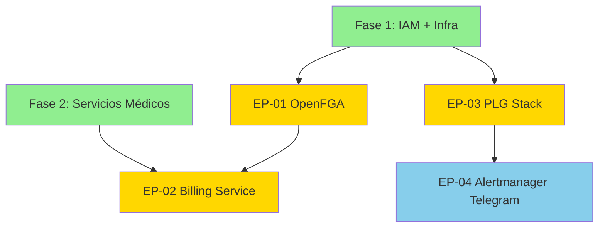

# Fase 3 — Plataforma Completa: Resumen de Épicas

| Campo | Valor |
|-------|-------|
| **Proyecto** | Serenidad — Clínica Digital de Salud Mental |
| **Fase** | 3 — Plataforma Completa |
| **Duración estimada** | 6 semanas (Sprint 7-9) |
| **Esfuerzo total** | ~280 horas ingeniería |
| **Costo incremental** | +$5-10/mes (observabilidad storage) |

---

## Visión General Fase 3

Fase 3 completa la plataforma Serenidad con **autorización granular (OpenFGA)**, **observabilidad completa PLG stack**, **billing multi-gateway** y **alertas a Telegram**. Cierra el MVP production-ready healthcare.

**Dependencias entrantes**: Fase 1 (infraestructura + IAM), Fase 2 (NATS + servicios médicos)

---

## Inventario de Épicas

| ID | Épica | Prioridad | Duración | HUs | Tareas |
|----|-------|-----------|----------|-----|--------|
| EP-01 | OpenFGA v1.x (AuthZ Zanzibar) | Crítica | 2 sem | 3 | ~25 |
| EP-02 | Billing & Ops Service | Crítica | 2 sem | 4 | ~30 |
| EP-03 | PLG Stack (Prometheus + Loki + Grafana + Tempo) | Alta | 2 sem | 4 | ~35 |
| EP-04 | Alertmanager → Telegram | Media | 1 sem | 2 | ~15 |

**Total**: 4 Épicas, 13 HUs, ~105 tareas/subtareas

---

## Mapa de Dependencias



**Orden de ejecución**:
1. **Sprint 7**: EP-01 (OpenFGA) + EP-03 inicio (Prometheus)
2. **Sprint 8**: EP-03 completar (Loki + Tempo) + EP-02 (Billing)
3. **Sprint 9**: EP-02 finalizar + EP-04 (Alertmanager Telegram)

---

## Definition of Done Global — Fase 3

Toda HU en Fase 3 debe cumplir:

### Código
- [ ] Go 1.25.x compilado sin warnings
- [ ] Tests unitarios >80% coverage crítico
- [ ] Integration tests con testcontainers
- [ ] Linting pasado (golangci-lint)

### Kubernetes
- [ ] Helm charts versionados en Git
- [ ] Manifests validados con kubectl --dry-run
- [ ] HPA y PDB configurados
- [ ] Resources requests/limits definidos
- [ ] Probes (readiness, liveness, startup)

### Observabilidad
- [ ] ServiceMonitor/PodMonitor configurado
- [ ] Métricas Prometheus exportadas
- [ ] Logs structured JSON a Loki
- [ ] Traces OTLP a Tempo
- [ ] Dashboards Grafana creados

### Seguridad
- [ ] Secrets en Kubernetes Secrets (no plaintext)
- [ ] NetworkPolicy restrictiva
- [ ] RBAC least-privilege
- [ ] TLS para comunicaciones externas

### Documentación
- [ ] README.md con arquitectura
- [ ] Runbooks operacionales
- [ ] API docs (Swagger/OpenAPI)

---

## Stack Tecnológico Fase 3

| Componente | Tecnología | Versión | Propósito |
|------------|------------|---------|-----------|
| **Authorization** | OpenFGA | v1.x | ReBAC Zanzibar healthcare |
| **Métricas** | Prometheus | v2.x | Time-series metrics |
| **Logs** | Loki | v3.7+ | Log aggregation |
| **Traces** | Tempo | v2.9+ | Distributed tracing |
| **Dashboards** | Grafana | v11.x | Visualización unificada |
| **Alertas** | Alertmanager | v0.27+ | Alert routing |
| **Notificaciones** | Telegram Bot | 2026 | Alertas críticas |
| **Billing** | Go microservice | 1.25.x | Multi-gateway payments |
| **Gateways** | Stripe/Conekta/Izipay | Latest | LATAM + Global |

---

## Criterios de Aceptación por Épica

### EP-01 — OpenFGA AuthZ

| # | Criterio | Verificación |
|---|----------|--------------|
| 1 | 3 replicas OpenFGA running | `kubectl get pods -n serenidad` |
| 2 | Authorization model healthcare deployed | Check query retorna 200 |
| 3 | <5ms p99 check latency | Prometheus metrics |
| 4 | Integration IAM Service funcional | JWT → OpenFGA check |

### EP-02 — Billing Service

| # | Criterio | Verificación |
|---|----------|--------------|
| 1 | Multi-gateway routing funcional | Charge Stripe/Conekta/Izipay exitoso |
| 2 | Financial ledger append-only | Query ledger muestra entries immutables |
| 3 | Idempotency 24h funcional | Retry con mismo key → mismo result |
| 4 | Outbox events a NATS | NATS sub muestra PaymentCaptured |
| 5 | Daily reconciliation job | Cron ejecuta sin errores |

### EP-03 — PLG Stack

| # | Criterio | Verificación |
|---|----------|--------------|
| 1 | Prometheus scraping all services | Targets all UP |
| 2 | Loki receiving logs | LogQL query retorna logs |
| 3 | Tempo receiving traces | Trace search funciona |
| 4 | Grafana dashboards operativos | Dashboard render sin errores |
| 5 | Traces-to-logs linking | Click trace → muestra logs |

### EP-04 — Alertmanager Telegram

| # | Criterio | Verificación |
|---|----------|--------------|
| 1 | Bot token configurado securely | Secret mounted en Alertmanager |
| 2 | Test alert delivery | Mensaje recibido en Telegram |
| 3 | Grouping funciona | Alerts agrupadas en mismo mensaje |
| 4 | Resolved notifications | Resolved alert enviada |

---

## Roadmap Visual Fase 3

```
Sprint 7 (Semanas 13-14)
├── EP-01: OpenFGA AuthZ
│   ├── Semana 13: Helm deployment + PostgreSQL
│   └── Semana 14: Authorization model + integration
└── EP-03: Prometheus + Alertmanager
    ├── Semana 13: kube-prometheus-stack Helm
    └── Semana 14: ServiceMonitors + alerting rules

Sprint 8 (Semanas 15-16)
├── EP-03: Loki + Tempo (completar PLG)
│   ├── Semana 15: Loki microservices + Promtail
│   └── Semana 16: Tempo + OTLP + Grafana datasources
└── EP-02: Billing Service (inicio)
    ├── Semana 15: PSP façade + ledger schema
    └── Semana 16: Stripe/Conekta/Izipay integration

Sprint 9 (Semanas 17-18)
├── EP-02: Billing Service (completar)
│   ├── Semana 17: Idempotency + webhooks
│   └── Semana 18: Reconciliation + testing
└── EP-04: Alertmanager → Telegram
    └── Semana 17: Bot creation + native receiver config

🎯 Milestone Fase 3: Plataforma Production-Ready
```

---

## Métricas de Éxito Fase 3

### Técnicas
- **Authorization latency**: <5ms p99 (OpenFGA check)
- **Observability coverage**: 100% servicios con métricas/logs/traces
- **Alert response time**: <2min notification critica
- **Payment success rate**: >99% (multi-gateway)
- **Reconciliation accuracy**: 100% daily matches

### Operacionales
- **Dashboards Grafana**: 5+ dashboards (Kubernetes, Services, Business)
- **Alerting rules**: 15+ rules críticas/warning
- **Telegram alerts**: 0 false positives en 1 semana
- **Billing uptime**: 99.9% (HA multi-gateway)

### Negocio
- **Authorization model healthcare**: 100% use cases cubiertos
- **LATAM payment coverage**: 3 países (MX, PE, CO)
- **Observability cost**: <$10/mes incremental
- **Incident response**: <30min MTTR con alertas Telegram

---

## Riesgos y Mitigaciones Fase 3

| Riesgo | Impacto | Probabilidad | Mitigación |
|--------|---------|--------------|------------|
| OpenFGA authorization model incorrecto | Alto | Media | Testing exhaustivo con all use cases healthcare |
| PLG stack storage costs alto | Medio | Alta | Retention policies strict (15-30d), S3 lifecycle |
| Payment gateway downtime | Crítico | Baja | Multi-gateway failover, circuit breaker |
| Telegram rate limiting alertas | Medio | Media | Grouping alerts, batch notifications |
| Loki cardinality explosion | Alto | Media | Max 15 labels, monitoring cardinality metrics |
| Billing reconciliation discrepancies | Alto | Baja | Daily automated job + manual review queue |

---

## Entregables Finales Fase 3

### Infraestructura
- OpenFGA cluster (3 replicas) con authorization model v1
- kube-prometheus-stack (Prometheus + Alertmanager + Grafana)
- Loki microservices cluster + Promtail DaemonSet
- Tempo distributed cluster
- Telegram Bot configurado

### Servicios
- Billing & Ops Service (Go microservice)
- PSP façade (Stripe, Conekta, Izipay)
- Financial ledger (PostgreSQL append-only)
- Reconciliation job (CronJob daily)

### Observabilidad
- 5+ Grafana dashboards
- 15+ PrometheusRules (alerting)
- ServiceMonitors para todos los servicios
- Traces-to-logs-to-metrics linking
- Alertmanager → Telegram integration

### Documentación
- Runbooks operacionales (incident response)
- Authorization model docs
- Payment gateway integration guide
- Observability stack architecture
- Alert escalation policies

---

**Tiempo total Fase 3**: 6 semanas  
**Esfuerzo**: ~280 horas ingeniería + 60 horas testing + 20 horas deployment  
**Costo incremental**: +$5-10/mes (observabilidad storage S3/MinIO)
