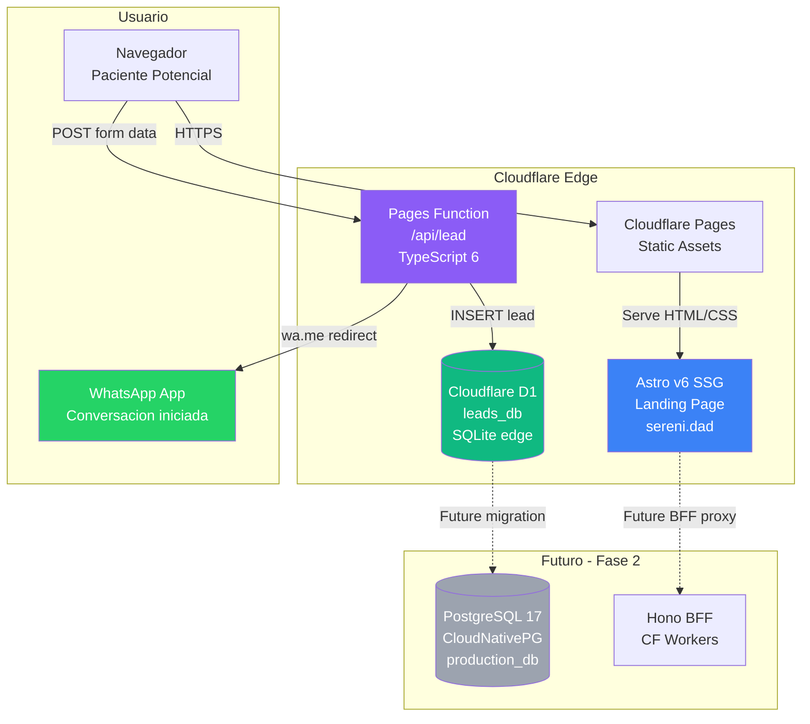
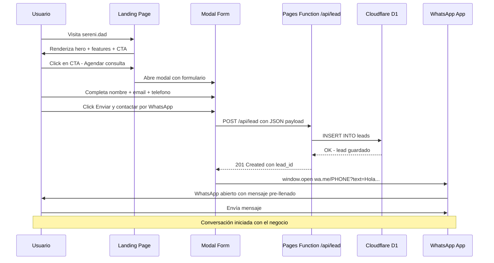
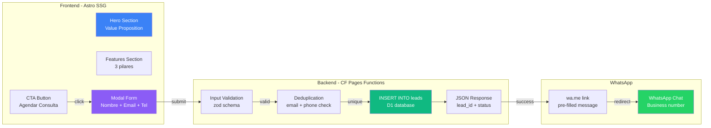
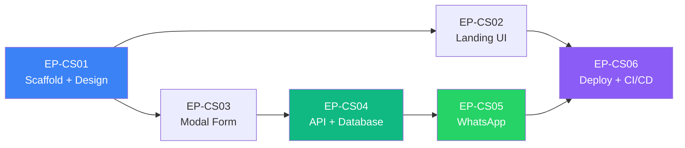

# Plan Coming Soon — Serenidad Landing Page

| Campo | Valor |
|-------|-------|
| **Proyecto** | Serenidad — Clínica Digital de Salud Mental |
| **Tipo** | Plan de Implementación — Landing Page Coming Soon |
| **Fecha** | Abril 2026 |
| **Autor** | djca |
| **Estado** | Planificación |
| **Modo** | Scrum Master — Product Backlog con Épicas y User Stories |

---

## 1. Visión del Producto

Construir una **landing page "Coming Soon"** para Serenidad que permita captar leads potenciales antes del lanzamiento completo de la plataforma. La página debe transmitir profesionalismo, confianza y calma — coherente con una clínica digital de salud mental.

### Objetivos de Negocio

1. **Captar leads** de pacientes potenciales interesados en terapia online
2. **Iniciar conversación por WhatsApp** como canal primario de contacto pre-lanzamiento
3. **Posicionar la marca** Serenidad en el espacio de salud mental digital
4. **SEO foundation** para el dominio `sereni.dad` desde antes del lanzamiento

### Objetivos Técnicos

1. **Lighthouse 95+** en Performance, Accessibility y SEO
2. **Zero JS por defecto** — Astro SSG con hidratación selectiva solo para el modal
3. **Costo $0/mes** — Cloudflare Pages + D1 free tier
4. **Migration path** claro hacia la landing page completa (EP-05 Fase 2)

---

## 2. Stack Tecnológico

| Componente | Tecnología | Versión | Justificación |
|-----------|------------|---------|---------------|
| Framework | Astro | v6.x | SSG, zero JS por defecto, Lighthouse 99+. Compatible con Qwik v2. |
| Styling | TailwindCSS | v4.x | Utility-first, tree-shaking, design tokens como configuración. |
| Iconografía | Lucide | latest | Iconos SVG ligeros, tree-shakeable, diseño limpio. |
| Runtime Forms | Vanilla JS | ES2022 | Solo el modal requiere JS. Sin framework. Mínimo bundle. |
| API Endpoint | Cloudflare Pages Functions | native | Worker ligero para form submission. Sin servidor dedicado. |
| Base de Datos | Cloudflare D1 | free tier | SQLite at the edge. 5M reads/100K writes/día gratis. Migration path a PostgreSQL. |
| Deployment | Cloudflare Pages | free tier | 500 builds/mes, bandwidth ilimitado, preview deployments. |
| DNS | Cloudflare | free tier | Proxy, CDN, SSL automático. |
| CI/CD | GitLab CI | free tier | Pipeline de build + Lighthouse CI. |
| Lenguaje | TypeScript | 6.0 | Puente hacia TS 7. `verbatimModuleSyntax`, sin `enum`. |

### ADR-CS001: Cloudflare D1 como almacenamiento temporal de leads

**Decisión**: Usar Cloudflare D1 (SQLite at the edge) para almacenar leads del formulario Coming Soon.

**Razón**:
- Free tier: 5M reads/día, 100K writes/día, 5GB storage — más que suficiente para pre-launch
- Zero infraestructura: sin VPS, sin Kubernetes, sin operador PostgreSQL
- Integración nativa con Cloudflare Pages Functions
- SQL estándar: migración a PostgreSQL 17 (CloudNativePG) es directa
- Latencia <5ms en edge reads

**Rechazado**:
- PostgreSQL en VPS (infraestructura no está lista — Fase 1 pendiente)
- Supabase/Neon (dependencia de terceros, contradice R4: Soberanía Tecnológica)
- Google Sheets API (no es una base de datos, sin query capabilities)
- Formspree/Getform (datos en terceros, sin control)

**Migration path a producción**:
```
D1 (coming soon) → Export CSV/SQL → Import a PostgreSQL 17 (CloudNativePG)
                                              ↓
                                   IAM Domain Service gestiona leads
                                   como eventos NATS [LeadCaptured]
```

### ADR-CS002: WhatsApp via wa.me link (sin Business API)

**Decisión**: Usar `https://wa.me/<number>?text=<encoded_message>` para iniciar la conversación WhatsApp, sin integración con WhatsApp Business API.

**Razón**:
- Zero costo, zero infraestructura adicional
- Experiencia nativa: abre la app de WhatsApp directamente
- Pre-filled message con datos del lead
- No requiere verificación de negocio ni approval de Meta
- Suficiente para volumen pre-launch

**Rechazado**:
- WhatsApp Cloud API (requiere Meta Business verification, webhook server, costo por conversación)
- Twilio WhatsApp (costo por mensaje, dependencia de terceros)

**Futura evolución** (Fase 3+):
- Migrar a WhatsApp Business API cuando el volumen lo requiera
- Usar el Billing & Ops Service para gestionar conversaciones
- Integrar con el Scheduling Service para agendar desde WhatsApp

---

## 3. Arquitectura del Sistema

### 3.1 Diagrama de Arquitectura



### 3.2 Flujo de Usuario Principal



### 3.3 Flujo de Datos



### 3.4 Component Architecture

```mermaid
graph TD
    subgraph Astro SSG Pages
        INDEX[index.astro<br/>Landing Page Unica]
    end

    subgraph Layouts
        BASE[BaseLayout.astro<br/>SEO + Meta + Fonts]
    end

    subgraph Components - UI
        HERO_C[Hero.astro<br/>Headline + Subtext + CTA]
        FEAT_C[Features.astro<br/>3 cards con iconos]
        FOOTER_C[Footer.astro<br/>Legal + Links]
        DISCLAIMER_C[Disclaimer.astro<br/>No PHI notice]
    end

    subgraph Components - Modal
        MODAL_C[LeadModal.astro<br/>Container + backdrop]
        FORM_C[LeadForm.ts<br/>Client-side JS<br/>Validation + Submit]
    end

    subgraph API
        API_R[/api/lead.ts<br/>Pages Function<br/>POST handler]
    end

    subgraph Database
        D1_S[(leads table<br/>D1 SQLite)]
    end

    INDEX --> BASE
    INDEX --> HERO_C
    INDEX --> FEAT_C
    INDEX --> FOOTER_C
    INDEX --> DISCLAIMER_C
    INDEX --> MODAL_C
    MODAL_C --> FORM_C
    FORM_C -->|fetch POST| API_R
    API_R -->|INSERT| D1_S

    style FORM_C fill:#F59E0B,color:#000
    style API_R fill:#8B5CF6,color:#fff
    style D1_S fill:#10B981,color:#fff
```

---

## 4. Mapa de Épicas y User Stories

| Épica | Nombre | User Stories | Prioridad |
|-------|--------|-------------|-----------|
| EP-CS01 | Project Scaffold & Design System | HU-CS01.1, HU-CS01.2 | Must Have |
| EP-CS02 | Landing Page UI | HU-CS02.1, HU-CS02.2, HU-CS02.3 | Must Have |
| EP-CS03 | Modal Form & Validation | HU-CS03.1, HU-CS03.2 | Must Have |
| EP-CS04 | Backend API & Database | HU-CS04.1, HU-CS04.2, HU-CS04.3 | Must Have |
| EP-CS05 | WhatsApp Integration | HU-CS05.1 | Must Have |
| EP-CS06 | Deployment & CI/CD | HU-CS06.1, HU-CS06.2 | Must Have |

### Dependencias entre Épicas



### Sprint Suggestion

| Sprint | Épicas | Entregable |
|--------|--------|-----------|
| Sprint 1 | EP-CS01 + EP-CS02 | Landing page visible localmente con todas las secciones |
| Sprint 2 | EP-CS03 + EP-CS04 | Formulario funcional con persistencia en D1 |
| Sprint 3 | EP-CS05 + EP-CS06 | WhatsApp integration + deployment a producción |

---

## 5. Modelo de Datos

### Tabla `leads` — Cloudflare D1

```sql
CREATE TABLE IF NOT EXISTS leads (
    id          INTEGER PRIMARY KEY AUTOINCREMENT,
    name        TEXT NOT NULL CHECK(length(name) >= 2),
    email       TEXT NOT NULL CHECK(email LIKE '%@%.%'),
    phone       TEXT NOT NULL CHECK(length(phone) >= 8),
    message     TEXT,
    source      TEXT NOT NULL DEFAULT 'coming_soon_landing',
    whatsapp_sent INTEGER NOT NULL DEFAULT 0,
    created_at  TEXT NOT NULL DEFAULT (datetime('now')),
    updated_at  TEXT NOT NULL DEFAULT (datetime('now')),
    UNIQUE(email, phone)
);

CREATE INDEX idx_leads_email ON leads(email);
CREATE INDEX idx_leads_created_at ON leads(created_at);
CREATE INDEX idx_leads_phone ON leads(phone);
```

### Campos del Formulario

| Campo | Tipo HTML | Required | Validación | Placeholder |
|-------|-----------|----------|------------|-------------|
| Nombre completo | `text` | Sí | Min 2 caracteres, solo letras y espacios | Tu nombre completo |
| Email | `email` | Sí | Formato email válido RFC 5322 | tu@email.com |
| Teléfono | `tel` | Sí | 8-15 dígitos, puede incluir + | +52 55 1234 5678 |
| Mensaje | `textarea` | No | Max 500 caracteres | ¿En qué podemos ayudarte? |

### API Contract

**POST /api/lead**

```typescript
// Request
interface LeadSubmission {
  name: string;    // min 2 chars
  email: string;   // valid email
  phone: string;   // 8-15 digits
  message?: string; // max 500 chars
}

// Response 201 Created
interface LeadCreated {
  id: number;
  status: 'created' | 'duplicate';
  whatsapp_url: string;
}

// Response 400 Bad Request
interface ValidationError {
  error: 'VALIDATION_ERROR';
  details: Array<{
    field: string;
    message: string;
  }>;
}

// Response 500 Internal Server Error
interface ServerError {
  error: 'INTERNAL_ERROR';
  message: string;
}
```

---

## 6. Diseño Visual — Tokens

### Paleta de Colores

| Token | Valor | Uso |
|-------|-------|-----|
| `--color-primary` | `#3B82F6` (Blue 500) | CTAs, links, headings |
| `--color-primary-dark` | `#2563EB` (Blue 600) | Hover states |
| `--color-secondary` | `#8B5CF6` (Violet 500) | Gradient accent, secondary buttons |
| `--color-accent` | `#10B981` (Emerald 500) | Success states, WhatsApp CTA |
| `--color-accent-dark` | `#059669` (Emerald 600) | WhatsApp CTA hover |
| `--color-bg` | `#FFFFFF` | Background principal |
| `--color-bg-alt` | `#F8FAFC` (Slate 50) | Sections alternas |
| `--color-text` | `#1E293B` (Slate 800) | Body text |
| `--color-text-muted` | `#64748B` (Slate 500) | Secondary text |
| `--color-whatsapp` | `#25D366` | WhatsApp brand color |

### Tipografía

| Elemento | Font | Weight | Size |
|----------|------|--------|------|
| Headings | Lexend Variable | 700-800 | 3rem-5rem |
| Body | Inter Variable | 400-500 | 1rem-1.125rem |
| CTA Buttons | Inter Variable | 600 | 1rem |
| Disclaimer | Inter Variable | 400 | 0.875rem |

### Espaciado

| Token | Valor |
|-------|-------|
| Section padding vertical | `5rem` (80px) |
| Container max-width | `1200px` |
| Container padding horizontal | `1.5rem` |
| Card padding | `2rem` |
| Card gap | `2rem` |
| Modal padding | `2rem` |

---

## 7. Performance Targets

| Métrica | Target | Herramienta de medición |
|---------|--------|------------------------|
| Lighthouse Performance | ≥ 95 | Lighthouse CI |
| Lighthouse Accessibility | ≥ 95 | Lighthouse CI |
| Lighthouse SEO | ≥ 95 | Lighthouse CI |
| LCP | < 1.5s | Web Vitals |
| CLS | < 0.05 | Web Vitals |
| INP | < 100ms | Web Vitals |
| TTFB | < 300ms | CF Analytics |
| Total JS bundle | < 5KB gzipped | Build output |
| Total CSS | < 15KB gzipped | Build output |

---

## 8. Restricciones y Cumplimiento

### Healthcare Compliance

| Requisito | Implementación |
|-----------|---------------|
| No PHI en landing page | Disclaimer visible: "Este sitio NO maneja información médica protegida" |
| Datos mínimos | Solo nombre, email, teléfono, mensaje — NO datos médicos |
| Privacy Policy | Link a política de privacidad (página o PDF) |
| HTTPS obligatorio | Cloudflare SSL/TLS automático |
| Cookies mínimas | Sin tracking cookies, solo analytics first-party si se agrega |

### Accesibilidad (WCAG 2.1 AA)

| Requisito | Implementación |
|-----------|---------------|
| Contraste mínimo 4.5:1 | Verificado con todos los tokens de color |
| Focus visible | `focus:ring-2` en todos los interactivos |
| Alt text en imágenes | Todas las imágenes con `alt` descriptivo |
| Semántica HTML5 | `<header>`, `<main>`, `<section>`, `<footer>`, `<nav>` |
| Keyboard navigation | Tab order lógico, modal focus trap |
| Screen reader | `aria-label`, `aria-describedby`, `role="dialog"` |

---

## 9. Riesgos y Mitigaciones

| # | Riesgo | Impacto | Probabilidad | Mitigación |
|---|--------|---------|--------------|------------|
| 1 | D1 no disponible en región | Alto | Baja | CF D1 es global; fallback a KV temporal |
| 2 | WhatsApp link bloqueado por popup blocker | Medio | Media | Usar `window.location.href` en vez de `window.open` |
| 3 | Spam/bots en formulario | Medio | Alta | Honeypot field + rate limiting por IP |
| 4 | LCP regression por fonts | Medio | Media | `font-display: swap` + preconnect Google Fonts |
| 5 | Lead data loss antes de migración PG | Alto | Baja | Export CSV semanal automático via cron |
| 6 | Phone number format inconsistente | Bajo | Media | E.164 formatting en backend antes de guardar |

---

## 10. Estructura de Archivos del Proyecto

```
frontend/comingsoon/
├── astro.config.mjs
├── package.json
├── tsconfig.json
├── tailwind.config.mjs
├── wrangler.toml                    # D1 binding config
├── lighthouserc.json
├── public/
│   ├── favicon.svg
│   ├── og-image.jpg
│   ├── robots.txt
│   └── manifest.json
├── src/
│   ├── styles/
│   │   └── global.css
│   ├── layouts/
│   │   └── BaseLayout.astro
│   ├── components/
│   │   ├── Hero.astro
│   │   ├── Features.astro
│   │   ├── Footer.astro
│   │   ├── Disclaimer.astro
│   │   ├── LeadModal.astro
│   │   └── WhatsAppButton.astro
│   ├── scripts/
│   │   └── lead-form.ts             # Client-side JS (island)
│   ├── pages/
│   │   ├── index.astro
│   │   └── privacidad.astro
│   └── types/
│       └── lead.ts
├── functions/
│   └── api/
│       └── lead.ts                  # CF Pages Function
└── schema/
    └── 001_create_leads.sql         # D1 migration
```

---

## 11. Correspondencia con Arquitectura Target

| Componente Coming Soon | Componente Target | Fase | Migration Path |
|------------------------|-------------------|------|---------------|
| Astro v6 SSG landing | EP-05 HU-05.1 Astro landing | Fase 2 (2.E) | Evolución directa: agregar páginas |
| Cloudflare D1 leads | PostgreSQL 17 CloudNativePG | Fase 1 (1.C) | Export SQL → Import PG |
| Pages Function /api/lead | Hono BFF CF Workers | Fase 1 (1.G) | Migrar endpoint al BFF |
| wa.me link | WhatsApp Business API | Fase 3+ | Evolución cuando volumen lo requiera |
| CF Pages deployment | CF Pages deployment | Fase 2 (2.E) | Mismo, sin cambio |
| TailwindCSS v4 | TailwindCSS v4 | Fase 2 (2.E) | Mismo, sin cambio |

---

## 12. Referencias

| # | Documento | Relación |
|---|-----------|----------|
| 1 | [`target_arch/descripcion.md`](../target_arch/descripcion.md) | Arquitectura target completa |
| 2 | [`target_arch/descripcion_actualizada_v2026.md`](../target_arch/descripcion_actualizada_v2026.md) | Actualizaciones 2026 |
| 3 | [`plan/fase_2_motor_medico/05_EP05_landing_astro.md`](../plan/fase_2_motor_medico/05_EP05_landing_astro.md) | EP-05 Landing completa (target) |
| 4 | [`plan/fase_1_infraestructura/08_EP08_frontend_bff.md`](../plan/fase_1_infraestructura/08_EP08_frontend_bff.md) | BFF y SPA (target) |
| 5 | [`target_arch/informe_cambios_2026.md`](../target_arch/informe_cambios_2026.md) | Informe de cambios tecnológicos |
