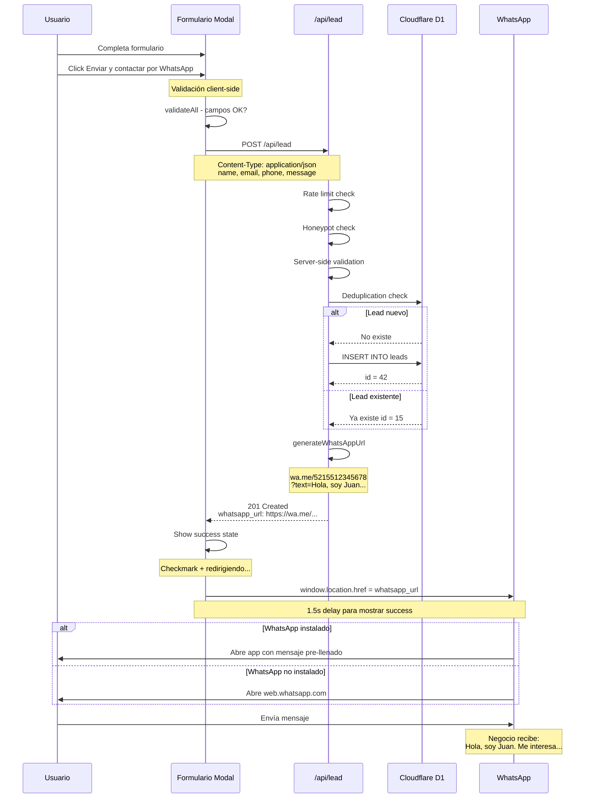

# EP-CS05 — WhatsApp Integration

**Épica:** Como visitante que completa el formulario, quiero que al hacer click en el CTA se guarde mi información Y se abra automáticamente WhatsApp con un mensaje pre-llenado, para que pueda iniciar una conversación directa con el equipo de Serenidad sin fricción.

**Prioridad:** Must Have — Core CTA functionality
**Sprint:** Sprint 3
**Dependencias Entrantes:** EP-CS04 (API endpoint que genera WhatsApp URL)
**Dependencias Salientes:** EP-CS06 (deployment)

---

## HU-CS05.1 — WhatsApp Deep Link & CTA Flow

**Como** visitante que envía el formulario,
**quiero** que WhatsApp se abra con un mensaje personalizado que incluya mi nombre,
**para que** la conversación comience de forma natural y el equipo sepa quién soy.

### Principios de Integración

1. **Zero API dependency:** No se usa WhatsApp Business API, solo deep links `wa.me`
2. **Pre-filled message:** Mensaje personalizado con nombre del lead
3. **Graceful degradation:** Si WhatsApp no está instalado, abre WhatsApp Web
4. **No popup blocker:** Usar `window.location.href` en vez de `window.open`
5. **Configurable number:** Número de WhatsApp configurable via env var

### Flujo Detallado del CTA



### Tareas y Subtareas

#### T-CS05.1.1 — Configurar número de WhatsApp

- **ST-CS05.1.1.1** — Configurar variable de entorno `WHATSAPP_NUMBER`.

  **En Cloudflare Pages dashboard:**
  1. Ir a Settings → Environment variables
  2. Agregar variable: `WHATSAPP_NUMBER` = `5215512345678`
     - Formato: código país + número sin espacios ni guiones
     - Ejemplo México: `5215512345678` (52 + 1 + 55 1234 5678)
  - **CA:** Variable `WHATSAPP_NUMBER` configurada en CF Pages.

  **Para desarrollo local (`.dev.vars`):**
  ```
  WHATSAPP_NUMBER=5215512345678
  ```
  - **CA:** `.dev.vars` creado (agregar a `.gitignore`).

- **ST-CS05.1.1.2** — Actualizar `.gitignore`.
  ```
  # Environment
  .dev.vars
  .env
  .env.local
  ```
  - **CA:** `.dev.vars` excluido de git.

#### T-CS05.1.2 — Generación de WhatsApp URL en backend

- **ST-CS05.1.2.1** — La función `generateWhatsAppUrl` ya está implementada en `functions/api/lead.ts` (ver EP-CS04).

  **Formato de URL generada:**
  ```
  https://wa.me/5215512345678?text=Hola%2C%20soy%20Juan%20Pérez.%20Me%20interesa%20saber%20m%C3%A1s%20sobre%20Serenidad%20y%20agendar%20una%20consulta.
  ```

  **Mensaje pre-llenado (decodificado):**
  ```
  Hola, soy [Nombre]. Me interesa saber más sobre Serenidad y agendar una consulta.
  ```

  **Si el usuario incluye mensaje:**
  ```
  Hola, soy [Nombre]. Me interesa saber más sobre Serenidad y agendar una consulta. Mi consulta: [mensaje del usuario]
  ```

  - **CA:** URL generada con nombre del lead y mensaje opcional.

#### T-CS05.1.3 — Redirección en el frontend

- **ST-CS05.1.3.1** — La redirección ya está implementada en `lead-form.ts` (ver EP-CS03).

  **Comportamiento:**
  1. Response del API contiene `whatsapp_url`
  2. Se muestra success state durante 1.5 segundos
  3. `window.location.href = whatsapp_url` ejecuta la redirección
  4. WhatsApp se abre (app o web según dispositivo)

  **Por qué `window.location.href` y no `window.open`:**
  - `window.open` es bloqueado por popup blockers
  - `window.location.href` es tratado como navegación normal
  - En móviles, `wa.me` deep link abre la app directamente
  - En desktop, abre WhatsApp Web en la misma pestaña

  - **CA:** Redirección funciona sin popup blockers.

#### T-CS05.1.4 — WhatsApp link en Footer

- **ST-CS05.1.4.1** — Agregar link de WhatsApp en el Footer (ya implementado en EP-CS02).

  **Link directo sin formulario:**
  ```
  https://wa.me/5215512345678?text=Hola%2C%20me%20interesa%20saber%20m%C3%A1s%20sobre%20Serenidad
  ```

  Este link permite a los usuarios contactar directamente sin pasar por el formulario. Es un canal alternativo.

  - **CA:** Footer tiene link de WhatsApp funcional.

#### T-CS05.1.5 — Manejo de edge cases

- **ST-CS05.1.5.1** — Documentar edge cases y soluciones.

  | Edge Case | Solución |
  |-----------|----------|
  | WhatsApp no instalado en móvil | `wa.me` redirige a App Store/Play Store |
  | Desktop sin WhatsApp | `wa.me` abre web.whatsapp.com |
  | Usuario cancela WhatsApp | Vuelve a la landing page (success state visible) |
  | Número incorrecto | Error visible en WhatsApp, lead ya guardado en D1 |
  | Redirección bloqueada | Success state con link manual como fallback |

- **ST-CS05.1.5.2** — Agregar fallback link en success state.

  Actualizar el success state en `LeadModal.astro`:
  ```astro
  <!-- Success state con fallback -->
  <div id="lead-success" class="hidden text-center py-4">
    <div class="w-16 h-16 bg-accent/10 rounded-full flex items-center justify-center mx-auto mb-4">
      <svg class="w-8 h-8 text-accent" ...>...</svg>
    </div>
    <h3 class="text-xl font-display font-bold text-text mb-2">¡Registro exitoso!</h3>
    <p class="text-text-muted mb-4">
      Te estamos redirigiendo a WhatsApp...
    </p>
    <p id="whatsapp-fallback" class="text-sm text-text-muted hidden">
      Si no se abrió WhatsApp automáticamente,
      <a id="whatsapp-fallback-link" href="#" class="text-whatsapp underline" target="_blank" rel="noopener noreferrer">
        haz click aquí
      </a>.
    </p>
  </div>
  ```

  Agregar en `lead-form.ts`:
  ```typescript
  // After setting whatsapp_url, show fallback after 3s
  setTimeout(() => {
    const fallback = document.getElementById('whatsapp-fallback');
    const fallbackLink = document.getElementById('whatsapp-fallback-link') as HTMLAnchorElement;
    if (fallback && fallbackLink) {
      fallbackLink.href = result.whatsapp_url;
      fallback.classList.remove('hidden');
    }
  }, 3000);
  ```
  - **CA:** Fallback link visible 3 segundos después del success si WhatsApp no abrió.

### Criterios de Aceptación — HU-CS05.1

| # | Criterio | Verificación |
|---|----------|--------------|
| 1 | WhatsApp URL generada correctamente | URL contiene wa.me + número + texto codificado |
| 2 | Mensaje incluye nombre del lead | "Hola, soy Juan..." |
| 3 | Mensaje incluye consulta si existe | "Mi consulta: ..." |
| 4 | Redirección funciona en móvil | WhatsApp app se abre |
| 5 | Redirección funciona en desktop | WhatsApp Web se abre |
| 6 | Fallback link visible | Si no redirige, link manual aparece a los 3s |
| 7 | Footer link funciona | Click en WhatsApp footer → abre chat |
| 8 | Número configurable | Cambiar env var cambia el número |

### Definition of Done — HU-CS05.1

- [ ] Variable WHATSAPP_NUMBER configurada (local + producción)
- [ ] URL de WhatsApp generada con nombre personalizado
- [ ] Redirección funciona en móvil y desktop
- [ ] Fallback link para casos donde no redirige
- [ ] Footer tiene link de WhatsApp alternativo
- [ ] .dev.vars creado y en .gitignore
- [ ] Edge cases documentados

---

## Resumen de Entregables EP-CS05

**Configuración:**
- `WHATSAPP_NUMBER` env var en Cloudflare Pages
- `.dev.vars` para desarrollo local
- `.gitignore` actualizado

**Integración:**
- URL generation en backend (ya en EP-CS04)
- Redirección en frontend (ya en EP-CS03)
- Fallback link en success state

**Links:**
- CTA principal: Formulario → API → WhatsApp redirect
- Footer link: Directo a WhatsApp sin formulario

**Edge cases cubiertos:**
- WhatsApp no instalado → App Store / Web
- Redirección bloqueada → Fallback link manual
- Número configurable → Env var
