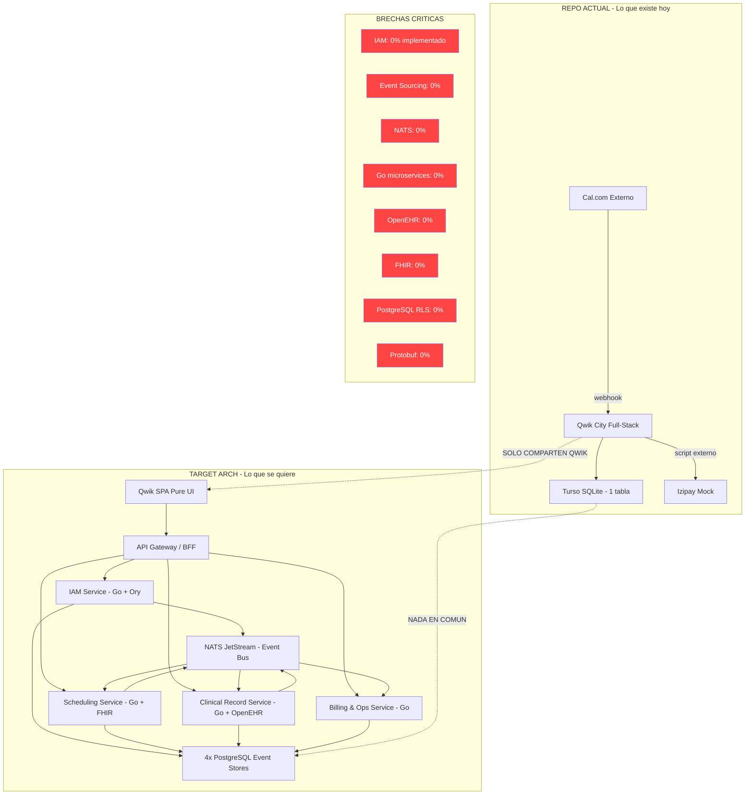

# Análisis Comparativo Exhaustivo: Repo Actual vs. Arquitectura Target

**Proyecto:** Serenamente — Clínica Digital de Salud Mental  
**Autor del análisis:** djca / Roo Architect Mode  
**Fecha:** Abril 2026  
**Fuentes primarias:** `src/`, `plan/`, `forensics/`, `target_arch/`

---

## Índice

1. [Resumen Ejecutivo del Contraste](#1-resumen-ejecutivo-del-contraste)
2. [Genoma del Repo Actual](#2-genoma-del-repo-actual)
3. [Genoma del Target Arch](#3-genoma-del-target-arch)
4. [Tabla Comparativa Maestral](#4-tabla-comparativa-maestral)
5. [Análisis por Dimensión Técnica](#5-análisis-por-dimensión-técnica)
6. [Narrativa de la Distancia Arquitectónica](#6-narrativa-de-la-distancia-arquitectónica)
7. [Deuda Técnica Acumulada vs. Deuda Target](#7-deuda-técnica-acumulada-vs-deuda-target)
8. [Diagrama de Brechas Visualizadas](#8-diagrama-de-brechas-visualizadas)
9. [Conclusiones y Veredicto](#9-conclusiones-y-veredicto)

---

## 1. Resumen Ejecutivo del Contraste

El repositorio actual `serenidad-mvp` es un **monolito front-edge** construido sobre Qwik City + Cloudflare Pages + Turso (LibSQL), diseñado para un flujo de negocio muy específico y acotado: recibir webhooks de Cal.com, redirigir a un pago con Izipay, y cancelar citas no pagadas vía un cron job. Su filosofía operativa real es la de un **MVP de solopreneur** con fricción operativa mínima.

El `target_arch` representa una ruptura paradigmática completa: una **plataforma clínica distribuida de grado médico**, con microservicios en Go, event sourcing via NATS JetStream, IAM multi-capa con Ory Kratos + Keto, diseño orientado a OpenEHR, bases de datos PostgreSQL federadas por servicio, y una capa frontend Qwik de ultra-velocidad. Su filosofía es **"Build It Right The First Time"** — sin deuda técnica asumida, sin MVP.

La distancia entre ambos no es incremental. Es una **reescritura total** de stack, paradigma, infraestructura, modelo de datos y filosofía de ingeniería.

---

## 2. Genoma del Repo Actual

### 2.1 Stack Tecnológico Real

| Capa | Tecnología Real | Versión | Rol |
|------|----------------|---------|-----|
| Runtime | Bun | 1.3.8 | Ejecutor JS/TS |
| Framework Web | Qwik City | ^1.19.0 | Full-stack (SSR + API routes) |
| UI | Tailwind CSS | v4.1.4 | Estilizado utilitario |
| Hosting | Cloudflare Pages | - | Edge deployment |
| Base de Datos | Turso (LibSQL) | @libsql/client ^0.17.0 | SQLite distribuido |
| Calendario/Bookings | Cal.com (externo) | API v1 | Webhook source |
| Pasarela de Pagos | Izipay | SDK (mock) | Procesador de pagos |
| Contenedor Dev | Docker Ubuntu 22.04 + Bun | - | Entorno local |
| Package Manager | Bun | - | Build + deps |
| Linting | ESLint 9.32.0 + TypeScript-ESLint | - | Calidad de código |
| Formatting | Prettier 3.6.2 | - | Estilo uniforme |

### 2.2 Arquitectura de Datos Real

```sql
-- schema.sql - La ÚNICA tabla de la aplicación
CREATE TABLE IF NOT EXISTS bookings (
    id INTEGER PRIMARY KEY AUTOINCREMENT,
    booking_uid TEXT UNIQUE NOT NULL,      -- UID de Cal.com
    status TEXT NOT NULL CHECK (status IN ('PENDING', 'PAID', 'EXPIRED', 'CANCELLED')),
    customer_email TEXT,
    customer_name TEXT,
    event_type_id INTEGER,
    start_time DATETIME,
    end_time DATETIME,
    created_at DATETIME DEFAULT CURRENT_TIMESTAMP,
    updated_at DATETIME DEFAULT CURRENT_TIMESTAMP
);
```

**Observación crítica:** El modelo de datos es un estado mutable con trigger de timestamp. No hay event sourcing, no hay inmutabilidad, no hay FHIR Appointment, no hay UUIDv7. Es un registro de estado plano en SQLite — lo más alejado posible del "Event Store Puro" del target.

### 2.3 Rutas y Endpoints Implementados

```
src/routes/
├── index.tsx                        → Landing Page estática (Hero + Servicios + Footer)
├── pago/
│   └── index.tsx                    → Página de pago con routeLoader$ de validación
└── api/
    └── webhooks/
        └── cal/
            └── index.ts             → POST handler: recibe Cal.com, inserta PENDING
```

**Total de rutas:** 3 (1 UI pública, 1 UI protegida, 1 API endpoint)

**Rutas pendientes según plan:**
- `api/webhooks/izipay/index.ts` — IPN de confirmación de pago (no implementado)
- `api/cron/cleanup/index.ts` — El "Reaper" de auto-cancelación (no implementado)

### 2.4 Componentes UI Reales

```
src/components/
├── izipay/
│   └── izipay-form.tsx     → SDK mock con useVisibleTask$, carga dinámica de script
├── layout/
│   └── footer/
│       └── index.tsx       → Footer minimalista con copyright
├── router-head/
│   └── router-head.tsx     → Meta tags estándar
└── ui/
    └── button/
        └── index.tsx       → Componente Button (primary/ghost)
```

### 2.5 Nivel de Completitud del Plan Ágil

| Épica | Historia | Estado | % |
|-------|---------|--------|---|
| E01-INFRA | 1.1 Docker + Bun | ✅ COMPLETO | 100% |
| E01-INFRA | 1.2 Cloudflare Pages | ✅ COMPLETO | 100% |
| E01-INFRA | 1.3 Turso DB | ⚠️ PARCIAL | 75% (CLI pendiente) |
| E02-UI | 2.1 Sistema de Diseño | ✅ COMPLETO | 100% |
| E02-UI | 2.2 Componentes Nucleares | ✅ COMPLETO | 100% |
| E02-UI | 2.3 Landing Page | ✅ COMPLETO | 100% |
| E03-CORE | 3.1 Webhook Cal.com | ✅ COMPLETO | 100% |
| E03-CORE | 3.2 Página de Pago | ✅ COMPLETO | 100% |
| E03-CORE | 3.3 Confirmación Izipay | ❌ PENDIENTE | 0% |
| E03-CORE | 3.4 Reaper (auto-cancel) | ❌ PENDIENTE | 0% |
| E04-QA | 4.1 Deploy + E2E | ❌ PENDIENTE | 0% |

**Completitud general del MVP original: ~72%**

---

## 3. Genoma del Target Arch

### 3.1 Stack Tecnológico Target

| Capa | Tecnología Target | Rol |
|------|------------------|-----|
| Frontend | Qwik (SPA Ultra-rápida) | UI, videoconsultas, telemedicina |
| API Gateway / BFF | Servicio dedicado | Enrutamiento, Rate Limiting, REST → microservicios |
| IAM Service | Go + Ory Kratos + Ory Keto + PostgreSQL | Autenticación, RBAC/ABAC, DIDs, Passkeys |
| Scheduling Service | Go + PostgreSQL | Zonas horarias, slots, FHIR Appointment output |
| Clinical Record Service | Go + OpenEHR + PostgreSQL | Event Store puro, arquetipos clínicos, inmutable |
| Billing & Ops Service | Go + PostgreSQL | Facturación, pasarelas de pago, regulaciones |
| Message Broker | NATS / JetStream | Eventos de dominio en Protobuf |
| Serialización | Protocol Buffers (Protobuf) | Eventos serializados entre servicios |
| DB Driver | Go pgxpool | Conexiones de alta performance a PostgreSQL |
| Primary Keys | UUIDv7 | Sortable, temporalmente ordenados |
| Outbox Pattern | PostgreSQL + Worker | Garantía de al-menos-una-entrega de eventos |
| Identity Protocol | DIDs (Decentralized Identifiers) | Identidad soberana del paciente |
| AuthN | Passkeys / WebAuthn | Cero contraseñas por defecto |
| AuthZ | Zanzibar (Ory Keto) | Grafos de permisos tipo Google Zanzibar |
| Row-Level Security | PostgreSQL RLS | Aislamiento de datos por tenancy |
| JWT | Go firmante | JWTs enriquecidos con UUIDv7 para RLS |

### 3.2 Microservicios Definidos

```
Fase 1 (MVP Arquitectural):
  [1] IAM & Identity Service     → El guardián
  
Fase 2 (Core Médico):
  [2] Scheduling Service         → El "Calendly" propio
  [2] Clinical Record Service    → El cerebro médico
  
Fase 3 (Operaciones):
  [3] Billing & Ops Service      → Facturación
  [4] API Gateway / BFF          → Enrutamiento (¿por qué es Fase 3/4 si es la entrada?)
```

### 3.3 Modelo de Eventos de Dominio

```
Eventos publicados:
  DB_IAM      → NATS: [DoctorOnboarded]
  DB_Sched    → NATS: [AppointmentBooked]
  DB_Clin     → NATS: [DiagnosisRecorded]

Eventos consumidos:
  NATS → Clinical:    [AppointmentBooked]      (crea registro clínico vacío al reservar)
  NATS → Billing:     [ConsultationFinished]   (dispara facturación post-consulta)
  NATS → Scheduling:  [DoctorOffboarded]       (cancela slots del doctor)
```

### 3.4 Bases de Datos por Servicio

```
DB_Identity  → Usuarios, Credenciales, Políticas RLS  (Kratos DB + Keto DB + Domain DB)
DB_Scheduling → Event Store con Outbox + EXCLUDE Constraints
DB_Clinical  → Event Store Puro, BYTEA Protobuf, UUIDv7 PKs
DB_Billing   → Transacciones Financieras
```

---

## 4. Tabla Comparativa Maestral

| Dimensión | Repo Actual | Target Arch | Brecha |
|-----------|-------------|-------------|--------|
| **Paradigma** | Monolito edge (Cloudflare Worker unificado) | Microservicios distribuidos | 🔴 Total |
| **Lenguaje backend** | TypeScript (Qwik routes = API) | Go (microservicios) | 🔴 Total |
| **Runtime** | Bun / Cloudflare Edge Workers | Go binaries en contenedores | 🔴 Total |
| **Base de datos** | 1x SQLite (Turso) - mutable, simple | 4x PostgreSQL separadas - event stores inmutables | 🔴 Total |
| **Modelo de datos** | Estado mutable (`UPDATE status=...`) | Event Sourcing puro (append-only) | 🔴 Total |
| **Primary keys** | INTEGER AUTOINCREMENT | UUIDv7 | 🔴 Total |
| **Autenticación** | Sin IAM (0% implementado) | Ory Kratos + Passkeys/WebAuthn + DIDs | 🔴 Total |
| **Autorización** | Sin AuthZ (0% implementado) | Ory Keto (Google Zanzibar) + RLS PostgreSQL | 🔴 Total |
| **Mensajería** | Sin bus de eventos | NATS JetStream + Protobuf | 🔴 Total |
| **Protocolo médico** | Sin estándar médico | FHIR Appointment + OpenEHR arquetipos | 🔴 Total |
| **Historia clínica** | Sin implementación | Clinical Record Service (Event Store OpenEHR) | 🔴 Total |
| **Multi-tenancy** | No existe | RLS PostgreSQL por UUIDv7 del JWT | 🔴 Total |
| **Scheduling** | Cal.com externo (webhook) | Scheduling Service propio (Go + FHIR) | 🔴 Total |
| **Pagos** | Izipay SDK mock | Billing & Ops Service generalizable | 🟡 Parcial |
| **Frontend** | Qwik City (full-stack monolítico) | Qwik (SPA puro conectado a BFF) | 🟡 Parcial |
| **API Gateway** | Implícito en Qwik routes | Servicio dedicado (Rate Limiting, enrutamiento) | 🔴 Total |
| **Serialización** | JSON nativo | Protocol Buffers (Protobuf) | 🔴 Total |
| **Outbox Pattern** | No existe | PostgreSQL Outbox + Worker en cada servicio | 🔴 Total |
| **Videoconsultas** | No existe | En roadmap Qwik (WebRTC/telemedicina) | 🔴 Total |
| **DIDs / Identidad Soberana** | No existe | Gestionado por IAM Domain Service (Go) | 🔴 Total |
| **CI/CD** | No existe | Implícito en arquitectura professional | 🔴 Total |
| **Observabilidad** | `console.log` básico | Implícito (cada servicio Go necesita OTel) | 🔴 Total |
| **Tests** | 0% | Implícito (TDD en microservicios) | 🔴 Total |
| **Compliance HIPAA/GDPR** | No abordado | Implícito en diseño (inmutabilidad, DIDs) | 🔴 Total |
| **Escalabilidad** | Cloudflare auto-scale (limitado) | Microservicios + K8s ready | 🟡 Diferente |
| **Costo operativo (solo)** | ~$0-5/mes (Cloudflare free tier) | ~$50-200/mes mínimo (PostgreSQL, NATS, Go services) | 🔴 Dramático |
| **Curva de aprendizaje** | Baja (TS/Qwik conocido) | Muy alta (Go + OpenEHR + Zanzibar + Protobuf + NATS) | 🔴 Alta |

**Leyenda:** 🔴 Brecha total (no existe implementación) | 🟡 Parcial (concepto existe, implementación distinta)

---

## 5. Análisis por Dimensión Técnica

### 5.1 Frontend

**Actual:** Qwik City en modo full-stack. Las rutas son al mismo tiempo la UI y las APIs del backend. `src/routes/pago/index.tsx` usa `routeLoader$` que ejecuta SQL directamente. No hay separación de concerns — el ORM (en este caso `@libsql/client`) se llama desde el mismo archivo que renderiza la página.

**Target:** Qwik como **SPA pura** que se comunica con un API Gateway / BFF dedicado. El frontend no tiene acceso directo a ninguna base de datos. Toda la lógica pasa por el Gateway que a su vez enruta a los microservicios Go.

**Análisis:** La convergencia superficial (ambos usan Qwik) oculta una divergencia arquitectónica profunda. En el repo actual, Qwik = toda la aplicación. En el target, Qwik = sólo la capa de presentación. Esto implica una re-arquitectura de cada componente que actualmente tiene lógica de backend.

### 5.2 Persistencia

**Actual:** Una base de datos SQLite distribuida vía Turso. El modelo es OLTP clásico con estado mutable. `INSERT INTO bookings ... 'PENDING'` y luego `UPDATE bookings SET status = 'PAID'`. La historia del dato se sobreescribe.

**Target:** Cuatro bases de datos PostgreSQL completamente independientes, una por microservicio. El Clinical Record Service usa Event Sourcing **puro** — eventos en BYTEA (Protobuf serializado), nunca actualizaciones. La historia clínica es **inmutable por diseño**. DB_Scheduling usa el patrón Outbox (tabla adicional de eventos pendientes de publicar).

**Análisis:** La distancia es máxima. No sólo es un cambio de tecnología (SQLite → PostgreSQL) sino de paradigma completo (estado mutable → eventos inmutables). Migrar datos del esquema actual al target requeriría una capa de transformación ETL + event replay.

### 5.3 IAM — El Servicio Más Crítico y Más Ausente

**Actual:** **CERO implementación de IAM.** Las rutas de API no tienen ningún middleware de autenticación. El webhook de Cal.com acepta cualquier POST sin validación de firma. La página `/pago` sólo valida que el `bookingId` exista en la DB — no hay sesión de usuario. No hay roles, no hay permisos, no hay tokens.

**Target:** El IAM es el [Fase 1], es decir, el **primer servicio que debe construirse**. Orquesta Ory Kratos (autenticación con Passkeys/WebAuthn, MFA, sesiones), Ory Keto (autorización tipo Zanzibar con "Relación Tuples"), un IAM Domain Service en Go que enriquece JWTs con UUIDv7 del usuario, y ese JWT luego alimenta el Row-Level Security de todas las bases de datos PostgreSQL.

**Análisis:** Esta brecha es la más peligrosa. El repo actual tiene información médica (aunque sea solo booking_uids de citas de salud mental) completamente expuesta. El target reconoce explícitamente que IAM es el cimiento sobre el cual todo lo demás se construye. La pregunta es: ¿se puede construir IAM target-grade sobre el monolito actual, o se necesita un servicio separado desde cero?

### 5.4 Booking y Scheduling

**Actual:** Cal.com es un servicio externo que maneja toda la lógica de agendamiento. El repo solo recibe webhooks y registra el `booking_uid` como estado PENDING. No hay control sobre slots, disponibilidad, zonas horarias, ni lógica de negocio de agendamiento.

**Target:** Un Scheduling Service propio en Go que implementa la lógica de "Calendly interno" — disponibilidad de médicos, manejo de zonas horarias globales, slots con reglas de negocio, y output en formato FHIR Appointment. Cal.com sería descartado o relegado a un canal externo temporal.

**Análisis:** Cal.com en el repo actual es una dependencia de terceros con vendor lock-in implícito. El target internaliza esta lógica para tener control total sobre el modelo de datos médico y la experiencia del usuario.

### 5.5 Bus de Eventos

**Actual:** **No existe.** Toda la comunicación entre "servicios" es síncrona dentro del mismo proceso (Cloudflare Worker). No hay pub/sub, no hay eventos de dominio, no hay desacoplamiento temporal.

**Target:** NATS JetStream como columna vertebral. Los eventos se serializan en Protobuf antes de publicarse. Los servicios se suscriben a eventos específicos: Clinical escucha `AppointmentBooked` para preparar la historia clínica, Billing escucha `ConsultationFinished` para facturar, Scheduling escucha `DoctorOffboarded` para liberar slots.

**Análisis:** La ausencia de bus de eventos en el repo actual es coherente con su naturaleza monolítica. La introducción de NATS requiere infraestructura adicional, conocimiento de Protobuf, gestión de schemas de eventos, y una mentalidad completamente diferente de diseño (event-driven vs. request-response).

### 5.6 Estándares Médicos

**Actual:** Sin ningún estándar médico. La tabla `bookings` es agnóstica al dominio médico — podría ser para reservar canchas de tenis. Campos genéricos como `customer_email`, `status`, `start_time`.

**Target:** FHIR Appointment como output del Scheduling Service. OpenEHR como paradigma de diseño del Clinical Record Service. Los arquetipos OpenEHR garantizan que los datos clínicos sean semánticamente interoperables con otros sistemas de salud globalmente.

**Análisis:** La adopción de OpenEHR implica no solo aprender un estándar sino cambiar fundamentalmente cómo se modela la información. En OpenEHR no hay "tabla de diagnósticos" — hay arquetipos (como `openEHR-EHR-OBSERVATION.blood_pressure.v2`) que definen semánticamente qué es cada dato clínico. Esto es radicalmente diferente al diseño relacional tradicional.

---

## 6. Narrativa de la Distancia Arquitectónica

### 6.1 ¿Qué es realmente el repo actual?

El repo actual es una **prueba de concepto operativa** extraordinariamente bien ejecutada para su alcance. En términos de ingeniería de software, es un **trigger pipeline**:

```
Cal.com → Webhook POST → Turso INSERT → Usuario paga → Turso UPDATE → Cron borra si no paga
```

Es lineal, predecible, bajo costo, y suficiente para validar el flujo de negocio de **un único médico, un único servicio, un único país, una única pasarela de pagos**. La decisión de usar Cloudflare Pages + Turso es correcta para este scope: latencia global baja, cero servidores que administrar, SQLite que escala para miles de bookings.

### 6.2 ¿Qué es realmente el target?

El target es una **plataforma de salud digital de nivel enterprise**, diseñada para soportar:
- Miles de médicos de múltiples especialidades
- Cientos de miles de pacientes
- Cumplimiento regulatorio global (HIPAA, GDPR, regulaciones locales)
- Historia clínica inmutable y auditada legalmente
- Interoperabilidad con otros sistemas de salud (FHIR)
- Identidad soberana del paciente (DIDs)
- Billing multi-país y multi-divisa

### 6.3 ¿Son compatibles?

Conceptualmente sí (ambos usan Qwik, ambos tienen la idea de webhooks/eventos). Técnicamente, son mundos separados que comparten únicamente el nombre del proyecto y la visión de negocio.

**La metáfora precisa:** El repo actual es el plano piloto de un aeroplano de madera de los hermanos Wright. El target es el manual de diseño de un Airbus A380. Ambos vuelan. La transición no es "escalar el plano de madera" — es una reescritura completa con la misma destinación en mente.

---

## 7. Deuda Técnica Acumulada vs. Deuda Target

### 7.1 Deudas del Repo Actual (Respecto a su Propio Plan)

| ID | Deuda | Impacto en MVP | Impacto en Target |
|----|-------|---------------|------------------|
| DT-01 | IPN Izipay no implementado | 🔴 Crítico (sin confirmación de pago) | 🟡 Reemplazado por Billing Service |
| DT-02 | Reaper (cron auto-cancel) no implementado | 🔴 Crítico (agenda se bloquea) | 🟡 Lógica migra a Scheduling Service |
| DT-03 | Sin validación de firma webhook Cal.com | 🔴 Seguridad crítica | 🟡 IAM Service lo resuelve |
| DT-04 | Sin autenticación en ningún endpoint | 🔴 Seguridad crítica | 🔴 IAM Service es el Fase 1 del target |
| DT-05 | `process.env` para credenciales (no Cloudflare env) | 🟡 Funcional en dev, roto en prod | 🟡 Resuelto por infraestructura Go |
| DT-06 | Izipay mock (no integración real) | 🔴 No acepta pagos reales | 🟡 Billing Service generaliza esto |
| DT-07 | Sin tests (0% cobertura) | 🟡 Riesgo de regresiones | 🔴 Target requiere TDD desde cimiento |
| DT-08 | Sin deploy real a Cloudflare (no verificado en prod) | 🟡 Riesgo de bugs de producción | N/A (infraestructura cambia) |
| DT-09 | Turso CLI no instalado (DNS bloqueado) | 🟡 DB no provisionada | N/A (migra a PostgreSQL) |
| DT-10 | Monto de pago hardcodeado ($50.00) | 🟡 No configurable | 🟡 Billing Service dinamiza esto |

### 7.2 Deudas del Target (Respecto a su Propia Definición)

| ID | Deuda de Diseño | Riesgo |
|----|-----------------|--------|
| DT-T01 | API Gateway posicionado como Fase 3 pero es la entrada del sistema | 🔴 Sin Gateway en Fase 1, ¿cómo llega el frontend al IAM? |
| DT-T02 | Sin definición de cómo Qwik SPA se autentica contra Ory Kratos | 🟡 Flujo de login no diagramado |
| DT-T03 | DIDs no especificados (¿qué método DID? did:web, did:key?) | 🟡 Ambigüedad técnica |
| DT-T04 | Videoconsultas mencionadas en Frontend pero ningún servicio definido | 🟡 Brecha en el diseño |
| DT-T05 | Sin servicio de notificaciones (email, SMS para recordatorios) | 🟡 Flujo de negocio incompleto |
| DT-T06 | Sin observabilidad definida (logging, tracing, métricas) | 🟡 Operación ciega |
| DT-T07 | Sin estrategia de migración desde Cal.com | 🟡 ¿Cómo migrar reservas existentes? |
| DT-T08 | OpenEHR arquetipos no seleccionados (¿cuáles?) | 🟡 Necesita especialista en informática médica |

---

## 8. Diagrama de Brechas Visualizadas



---

## 9. Conclusiones y Veredicto

### 9.1 ¿El repo actual es un obstáculo o un trampolín?

**Es un trampolín, pero con condiciones.**

Lo que el repo actual ha demostrado exitosamente:
1. **Que Qwik funciona** para el frontend de la clínica — la UI/UX de "Serenidad Minimal" es real y deployable
2. **Que el flujo de negocio de reserva-pago es alcanzable** — la lógica existe aunque sea en mock
3. **Que la infraestructura de desarrollo (Docker + Bun)** es sólida y reproducible
4. **Que el equipo (solopreneur)** puede construir end-to-end sin dependencias externas

Lo que el repo actual NO aporta al target:
1. Ningún microservicio Go
2. Ningún PostgreSQL con event sourcing
3. Ningún IAM
4. Ningún protocolo médico
5. Ningún bus de eventos

### 9.2 Ruta Recomendada

La ruta no es "escalar el repo actual". La ruta es:

```
FASE 0 (Paralelo): Completar el MVP actual
  → Implementar IPN Izipay
  → Implementar Reaper cron
  → Desplegar a Cloudflare real
  → Conseguir el primer pago real
  → VALIDAR el negocio

FASE 1 (Post-validación): Construir el IAM target desde cero
  → Iniciar repositorio separado: serenidad-iam
  → Go + Ory Kratos + Ory Keto + PostgreSQL
  → El frontend Qwik migra gradualmente a este IAM

FASE 2: Construir Scheduling Service
  → Internalizar Cal.com con servicio propio
  → Output FHIR Appointment

FASE 3+: Clinical Record, Billing, BFF/Gateway
```

### 9.3 Veredicto Final

| Aspecto | Calificación | Justificación |
|---------|-------------|---------------|
| Calidad del código actual | 🟢 Buena | TypeScript limpio, Qwik idiomático, bien estructurado |
| Completitud del MVP actual | 🟡 Parcial | 72% completado, falta IPN y Reaper críticos |
| Alineación con target | 🔴 Mínima | Sólo Qwik en común, todo lo demás diverge |
| Viabilidad de migración directa | 🔴 No recomendable | Requiere reescritura completa del backend |
| Valor del repo actual como validación | 🟢 Alto | Prueba el flujo de negocio antes de sobre-ingeniería |
| Coherencia del target como visión | 🟢 Sólida | Arquitectura bien pensada para el problema correcto |

**El repo actual es un excelente MVP de validación de negocio. El target es la arquitectura correcta para el producto final. Son fases complementarias, no competidoras — siempre que se complete el MVP actual antes de iniciar la construcción del target.**

---

*Documento generado en Abril 2026 como parte del análisis comparativo exhaustivo del proyecto Serenamente.*
