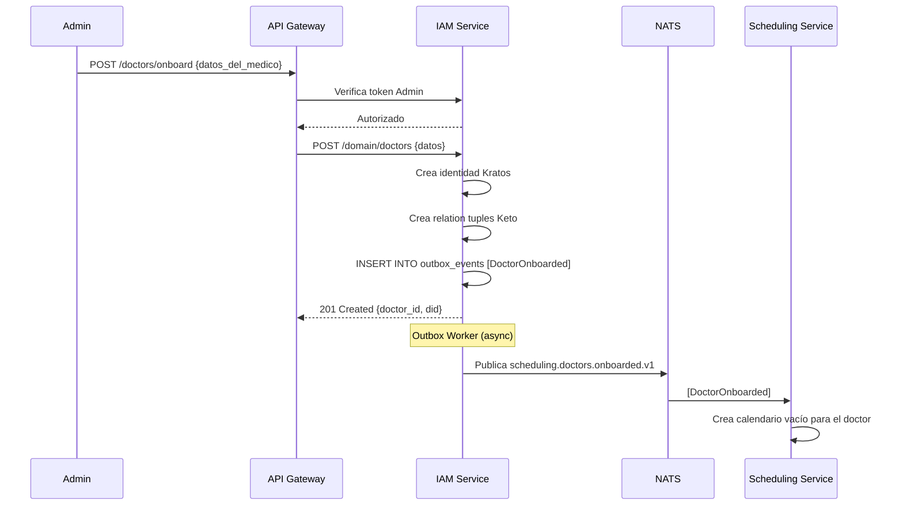
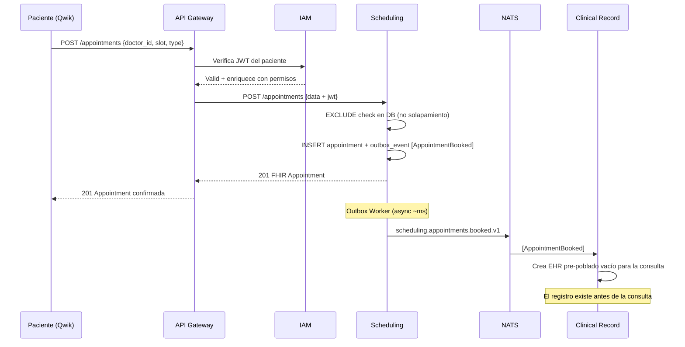
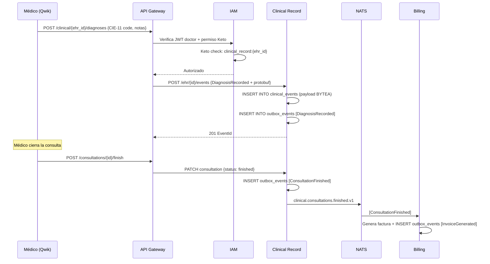

# Deep-Dive: Arquitectura Target "Build It Right The First Time"

**Proyecto:** Serenidad — Clínica Digital de Salud Mental Global  
**Fuente primaria:** `target_arch/descripcion.md`, `target_arch/arch.puml`, `target_arch/comp_iam_capa_core.puml`  
**Autor del análisis:** djca / Roo Architect Mode  
**Fecha:** Abril 2026

---

## Índice

1. [Filosofía y Principios Fundacionales](#1-filosofía-y-principios-fundacionales)
2. [Visión de Producto y Alcance](#2-visión-de-producto-y-alcance)
3. [Arquitectura Global — Capas y Contratos](#3-arquitectura-global--capas-y-contratos)
4. [Deep-Dive: Microservicio IAM](#4-deep-dive-microservicio-iam)
5. [Deep-Dive: Scheduling Service](#5-deep-dive-scheduling-service)
6. [Deep-Dive: Clinical Record Service](#6-deep-dive-clinical-record-service)
7. [Deep-Dive: Billing & Ops Service](#7-deep-dive-billing--ops-service)
8. [Deep-Dive: Event Bus NATS JetStream + Protobuf](#8-deep-dive-event-bus-nats-jetstream--protobuf)
9. [Deep-Dive: Persistencia y Event Stores](#9-deep-dive-persistencia-y-event-stores)
10. [Deep-Dive: Frontend Qwik SPA](#10-deep-dive-frontend-qwik-spa)
11. [Flujos de Negocio Críticos](#11-flujos-de-negocio-críticos)
12. [Restricciones de Diseño — Análisis Crítico](#12-restricciones-de-diseño--análisis-crítico)
13. [Decisiones Arquitectónicas Documentadas](#13-decisiones-arquitectónicas-documentadas)
14. [Evaluación de Riesgos del Target](#14-evaluación-de-riesgos-del-target)

---

## 1. Filosofía y Principios Fundacionales

### 1.1 La Declaración Central

El documento `target_arch/descripcion.md` establece explícitamente:

> *"El propósito central no es una salida rápida al mercado, sino la consolidación de un sistema informático médico que perdure por generaciones, protegiendo la integridad de la historia clínica, garantizando la privacidad absoluta del paciente y ofreciendo una ultra-velocidad en la experiencia del usuario."*

Esta declaración contiene **tres tensiones** que la arquitectura debe resolver simultáneamente:

| Tensión | Polo A | Polo B | Cómo el target lo resuelve |
|---------|--------|--------|---------------------------|
| Durabilidad vs. Velocidad de UI | Arquitectura rígida y formal | Latencia de interacción mínima | Event sourcing inmutable en backend + Qwik resumable en frontend |
| Privacidad vs. Accesibilidad | Datos herméticos | Médico puede ver la historia | RLS + JWT enriquecido + Zanzibar |
| Solopreneur vs. Enterprise | Operación simple | Escala a 10,000 médicos | Microservicios con PostgreSQL federado |

### 1.2 Las Cinco Restricciones Inquebrantables

El target establece cinco "Design Constraints" que funcionan como invariantes arquitectónicas:

#### Restricción 1: No MVP — Build It Right The First Time
**Significado técnico:** Cada componente se diseña para su forma final desde el primer commit. No se acepta "esto lo arreglamos después". Las APIs deben ser contratos estables. Las bases de datos deben tener el esquema de event sourcing desde el día uno.

**Implicación operativa:** El tiempo de desarrollo inicial es mayor, pero el costo de mantenimiento a largo plazo es significativamente menor. Aplica la filosofía del "boring code" de Dan Luu — código explícito, predecible, sin magia.

#### Restricción 2: Inmutabilidad Arquitectónica
**Significado técnico:** La adición de un nuevo médico, especialidad, o país no debe requerir cambios en el esquema de datos ni en los microservicios existentes. El Clinical Record Service debe funcionar igual para un psiquiatra en Lima que para un neurólogo en Berlín.

**Mecanismo:** OpenEHR resuelve esto mediante arquetipos clínicos intercambiables. Un arquetipo de "Consultation Note" es válido para cualquier especialidad. El esquema de event sourcing solo cambia si cambian los eventos de dominio, no si cambia el tipo de especialidad médica.

#### Restricción 3: Desacoplamiento Absoluto
**Significado técnico:** Ningún microservicio importa código de otro. La única forma de comunicación inter-servicio es mediante eventos de dominio (NATS JetStream) o llamadas síncronas al API Gateway. No hay llamadas directas entre servicios.

**Mecanismo:** El patrón Outbox garantiza que los eventos se publiquen con garantías de entrega. El API Gateway actúa como proxy, no como orquestador — no conoce la lógica de negocio interna de ningún servicio.

#### Restricción 4: Soberanía Tecnológica
**Significado técnico:** El stack elegido debe poder ser operado por una sola persona con herramientas estándar de la industria. No se aceptan vendor lock-ins ocultos ni herramientas que requieran un equipo de SREs para mantener.

**Tensión identificada:** Esta restricción entra en conflicto parcial con la elección de Ory Kratos + Ory Keto (dos servicios adicionales que administrar) y con Go (curva de aprendizaje alta). Ver sección de Evaluación de Riesgos.

#### Restricción 5: Ultravelocidad
**Significado técnico:** La capa de presentación (Qwik) debe tener TTI (Time to Interactive) cercano a cero. Las lecturas de datos deben tener latencia <100ms. Los writes transaccionales pueden ser más lentos (consistencia eventual).

**Mecanismo:** Qwik usa resumability — el estado del servidor se serializa y se "resume" en el cliente sin re-hidratación. Las lecturas usan proyecciones/read models que no requieren reconstruir el event log completo.

---

## 2. Visión de Producto y Alcance

### 2.1 Alcance Declarado

```
Inicio: 1 médico (psiquiatra/psicólogo) + pacientes de salud mental
Meta: Plataforma multiespecialidad con alcance global
Restricción de escala: Debe funcionar igual con 1 médico que con 10,000
```

### 2.2 Capacidades Implícitas en el Target

Aunque no todas están explícitamente enumeradas en el target, la arquitectura implica:

| Capacidad | Evidencia en la Arquitectura |
|-----------|------------------------------|
| Telemedicina / Videoconsultas | Frontend: "manejo de UI, videoconsultas y telemedicina" |
| Multi-especialidad | Scheduling Service con tipos de cita FHIR |
| Multi-país | Billing con "regulaciones locales" + DIDs para privacidad GDPR |
| Historia clínica interoperable | Clinical Record con OpenEHR |
| Identidad soberana del paciente | IAM con DIDs |
| Facturas y recibos | Billing & Ops Service |
| Portal del médico | Frontend + IAM roles (RBAC) |
| Portal del paciente | Frontend + IAM roles (ABAC) |
| Onboarding de médicos | Evento `DoctorOnboarded` desde IAM |
| Offboarding de médicos | Evento `DoctorOffboarded` → cancela slots |

---

## 3. Arquitectura Global — Capas y Contratos

### 3.1 Las Cuatro Capas

```
┌─────────────────────────────────────────────────────────┐
│                    CAPA DE INTERACCIÓN                  │
│  [Qwik SPA] ←→ [API Gateway / BFF]                     │
│  HTTP / WebSocket                                       │
└─────────────────────┬───────────────────────────────────┘
                      │ Peticiones autenticadas
┌─────────────────────▼───────────────────────────────────┐
│                  DOMINIO MÉDICO Y NEGOCIO               │
│  [IAM] [Scheduling] [Clinical Record] [Billing]         │
└─────────────────────┬───────────────────────────────────┘
                      │ Eventos de dominio (Protobuf)
┌─────────────────────▼───────────────────────────────────┐
│               COLUMNA VERTEBRAL DE EVENTOS              │
│  [NATS JetStream] ← pub/sub async                       │
└─────────────────────┬───────────────────────────────────┘
                      │ pgxpool
┌─────────────────────▼───────────────────────────────────┐
│               PERSISTENCIA Y EVENT STORES               │
│  [DB_Identity] [DB_Scheduling] [DB_Clinical] [DB_Billing]│
└─────────────────────────────────────────────────────────┘
```

### 3.2 Contratos Inter-Capa

| De | A | Protocolo | Formato |
|----|---|-----------|---------|
| Qwik SPA | API Gateway | HTTP/REST + WebSocket | JSON |
| API Gateway | IAM | HTTP/gRPC | JSON o Protobuf |
| API Gateway | Scheduling | HTTP/gRPC | JSON o Protobuf |
| API Gateway | Clinical | HTTP/gRPC | JSON o Protobuf |
| API Gateway | Billing | HTTP/gRPC | JSON o Protobuf |
| Servicios → DB | PostgreSQL | pgxpool TCP | SQL binario |
| DB Outbox → NATS | NATS Worker | NATS Core/JetStream | Protobuf binario |
| NATS → Servicios | Suscripción push | NATS JetStream | Protobuf binario |

---

## 4. Deep-Dive: Microservicio IAM

### 4.1 Responsabilidades

El IAM es el **guardián del sistema**. Es el primer microservicio que debe existir porque todos los demás dependen de él para:
1. Verificar que quien llama es quien dice ser (AuthN)
2. Verificar que tiene permiso para hacer lo que quiere hacer (AuthZ)
3. Proveer el JWT enriquecido que alimenta el RLS de PostgreSQL

### 4.2 Anatomía del IAM Bounded Context

```
IAM Bounded Context
│
├── IAM Domain Service (Go)          ← Tu código
│   ├── BFF de identidad
│   ├── Orquesta flujos DID
│   ├── Enriquece JWTs con UUIDv7
│   └── Traduce eventos: UserRegistered, DoctorOnboarded
│
├── Ory Kratos (AuthN)               ← Servicio externo gestionado
│   ├── Passkeys / WebAuthn (cero contraseñas)
│   ├── Gestión de sesiones
│   ├── MFA
│   └── DB: Kratos DB (PostgreSQL - esquema Ory)
│
└── Ory Keto (AuthZ - Zanzibar)      ← Servicio externo gestionado
    ├── Relation Tuples: "Médico_X es owner de Historia_123"
    ├── Check API: ¿puede Usuario_456 leer Historia_123?
    ├── Expand API: ¿quién puede leer Historia_123?
    └── DB: Keto DB (PostgreSQL - grafos de permisos)
```

### 4.3 El JWT Enriquecido — El Arma Secreta

El JWT que produce el IAM Domain Service no es un JWT estándar de autenticación. Es un **JWT de dominio médico** que contiene:

```json
{
  "sub": "01HV3K9P5N7Q8R6M4J2X0WBY3Z",  // UUIDv7 del usuario
  "iss": "iam.sereni.dad",
  "aud": "serenidad-services",
  "exp": 1735689600,
  "iat": 1735686000,
  "role": "doctor",                        // Rol primario para RLS
  "tenant_id": "01HV...",                  // Para multi-tenancy
  "did": "did:web:sereni.dad:users:...", // Identidad soberana
  "permissions": ["read:own_patients", "write:consultations"],
  "keto_namespace": "serenidad"          // Para verificación delegada a Keto
}
```

**¿Por qué UUIDv7 en el `sub`?** Los UUIDv7 son temporalmente ordenados (los primeros 48 bits son el timestamp en milisegundos). Esto significa que los JWTs más nuevos tienen un `sub` lexicográficamente mayor, lo que permite índices BTree eficientes en PostgreSQL. Un `WHERE user_id > '01HV...'` es tan eficiente como un `BETWEEN` en timestamps.

### 4.4 Row-Level Security en PostgreSQL

El JWT se convierte en el mecanismo de aislamiento de datos:

```sql
-- En cada base de datos de microservicio:
CREATE POLICY patient_isolation ON clinical_events
    USING (
        patient_id = current_setting('app.current_user_id')::uuid
        OR
        current_setting('app.current_role') = 'doctor'
        AND patient_id IN (
            SELECT patient_id FROM doctor_patient_assignments
            WHERE doctor_id = current_setting('app.current_user_id')::uuid
        )
    );

-- El servicio Go inyecta el JWT en la sesión PostgreSQL:
-- SET LOCAL app.current_user_id = '<uuid_del_jwt>';
-- SET LOCAL app.current_role = '<role_del_jwt>';
```

### 4.5 El Paradigma Zanzibar de Ory Keto

En lugar de roles planos (`admin`, `doctor`, `patient`), Zanzibar usa **Relation Tuples**:

```
# No guardas "Rol = Admin"
# Guardas relaciones específicas entre objetos y sujetos

# Ejemplo de relation tuples en Keto:
historia_clinica:HC-001#lector@usuario:paciente-456
historia_clinica:HC-001#escritor@usuario:doctor-123
historia_clinica:HC-001#propietario@usuario:paciente-456
cita:APT-789#participante@usuario:doctor-123
cita:APT-789#participante@usuario:paciente-456
```

**Consulta:** "¿Puede doctor-123 escribir en HC-001?"
```
Keto evalúa: historia_clinica:HC-001#escritor@usuario:doctor-123 → TRUE
```

**Consulta:** "¿Puede paciente-999 leer HC-001?"
```
Keto evalúa: historia_clinica:HC-001#lector@usuario:paciente-999 → FALSE
```

Esta arquitectura escala a **millones de relaciones** sin degradación de performance porque usa grafos en PostgreSQL optimizados para traversal.

### 4.6 DIDs — Identidad Soberana del Paciente

Los Decentralized Identifiers (DIDs) permiten que el paciente sea dueño de su identidad médica:

```
did:web:sereni.dad:patients:01HV3K9P5N7Q8R6M4J2X0WBY3Z
```

**Implicación práctica:** Si el paciente decide migrar a otra plataforma médica compatible con DIDs, puede llevar su identidad (y con ella, los permisos sobre su historia clínica) sin depender de Serenidad como custodio de su identidad. Esto es cumplimiento GDPR by design.

---

## 5. Deep-Dive: Scheduling Service

### 5.1 Responsabilidades

El Scheduling Service es el "Calendly interno" de Serenidade. Gestiona:
- Disponibilidad de médicos (con soporte de zonas horarias globales)
- Definición de tipos de cita (duración, precio, formato presencial/remoto)
- Reserva de slots con exclusividad garantizada
- Output en formato FHIR Appointment (R4)
- Publicación del evento `AppointmentBooked` vía Outbox → NATS

### 5.2 El Problema de Concurrencia — EXCLUDE Constraints

El target menciona explícitamente el uso de `EXCLUDE Constraints` en PostgreSQL para el DB_Scheduling. Esta es una de las decisiones técnicas más sofisticadas del diseño:

```sql
-- Problema: Dos pacientes intentan reservar el mismo slot simultáneamente
-- Solución: EXCLUDE constraint con rangos de tiempo

CREATE EXTENSION btree_gist;

CREATE TABLE appointments (
    id UUID PRIMARY KEY DEFAULT gen_random_uuid(),
    doctor_id UUID NOT NULL,
    patient_id UUID NOT NULL,
    time_slot TSTZRANGE NOT NULL,
    status TEXT NOT NULL DEFAULT 'BOOKED',
    fhir_resource JSONB,
    
    -- La magia: un doctor NO puede tener dos citas solapadas
    EXCLUDE USING GIST (
        doctor_id WITH =,
        time_slot WITH &&   -- && = operador "solapan" para rangos
    ) WHERE (status = 'BOOKED')
);
```

**¿Por qué no un simple UNIQUE?** Un `UNIQUE` sobre `(doctor_id, start_time)` no previene overlaps si los slots tienen duración variable. Un `EXCLUDE USING GIST` con el operador `&&` (rango se solapa con rango) garantiza que ningún doctor tenga dos citas solapadas en la base de datos, incluso con alta concurrencia y sin bloqueos en la aplicación.

### 5.3 Output FHIR Appointment

```json
{
  "resourceType": "Appointment",
  "id": "01HV3K9P5N7Q8R6M4J2X0WBY3Z",
  "status": "booked",
  "serviceType": [{
    "coding": [{
      "system": "http://snomed.info/sct",
      "code": "224930009",
      "display": "Psychiatry"
    }]
  }],
  "start": "2026-05-15T10:00:00-06:00",
  "end": "2026-05-15T11:00:00-06:00",
  "participant": [
    {
      "actor": {"reference": "Practitioner/doctor-uuid"},
      "status": "accepted"
    },
    {
      "actor": {"reference": "Patient/patient-uuid"},
      "status": "accepted"
    }
  ],
  "extension": [{
    "url": "https://sereni.dad/fhir/StructureDefinition/booking-source",
    "valueString": "serenidad-scheduling-v1"
  }]
}
```

---

## 6. Deep-Dive: Clinical Record Service

### 6.1 Responsabilidades

El Clinical Record Service es el **cerebro médico** del sistema. Su responsabilidad es:
- Mantener la historia clínica electrónica (EHR) de cada paciente
- Garantizar que los registros sean **inmutables** y **auditables**
- Usar OpenEHR como framework de modelado clínico
- Implementar Event Sourcing puro: el estado actual se reconstruye desde los eventos

### 6.2 OpenEHR como Paradigma

OpenEHR no es una base de datos — es un **lenguaje de modelado clínico** basado en arquetipos. Un arquetipo es una definición formal de un concepto clínico:

```
openEHR-EHR-OBSERVATION.blood_pressure.v2
openEHR-EHR-EVALUATION.problem_diagnosis.v1
openEHR-EHR-INSTRUCTION.medication_order.v3
openEHR-EHR-ACTION.medication.v1
openEHR-EHR-COMPOSITION.encounter.v1   ← Una consulta completa
```

**Para Serenidad (salud mental), los arquetipos relevantes serían:**
- `openEHR-EHR-EVALUATION.adverse_reaction_risk.v2` — Alergias y reacciones adversas
- `openEHR-EHR-OBSERVATION.mental_state_exam.v1` — Examen del estado mental
- `openEHR-EHR-EVALUATION.problem_diagnosis.v1` — Diagnóstico (con codificación CIE-10/CIE-11)
- `openEHR-EHR-INSTRUCTION.medication_order.v3` — Prescripciones de psicofármacos
- `openEHR-EHR-COMPOSITION.encounter.v1` — La composición completa de una consulta
- `openEHR-EHR-OBSERVATION.story.v1` — Anamnesis y motivo de consulta

### 6.3 Event Store Puro — La Historia Clínica como Log de Eventos

```sql
-- DB_Clinical: Event Store puro
CREATE TABLE clinical_events (
    id UUID PRIMARY KEY,                    -- UUIDv7 (ordenable por tiempo)
    aggregate_id UUID NOT NULL,             -- ID del EHR del paciente
    aggregate_type TEXT NOT NULL,           -- 'EHR', 'Composition', 'Observation'
    event_type TEXT NOT NULL,               -- 'DiagnosisRecorded', 'MedicationPrescribed'
    event_version INTEGER NOT NULL,         -- Para schema evolution
    payload BYTEA NOT NULL,                 -- Protobuf serializado del evento
    metadata JSONB,                         -- Contexto: doctor_id, timestamp, IP, etc.
    occurred_at TIMESTAMPTZ NOT NULL DEFAULT NOW(),
    causation_id UUID,                      -- El evento que causó este evento
    correlation_id UUID                     -- La request original que inició la cadena
);

-- NUNCA hay UPDATE ni DELETE en esta tabla
-- La "última versión" se reconstruye con:
-- SELECT * FROM clinical_events WHERE aggregate_id = ? ORDER BY id ASC
```

**Inmutabilidad legal:** En medicina, la historia clínica es un documento legal. No puede ser borrada ni modificada retroactivamente. Si un médico comete un error y necesita corregir un diagnóstico, NO se hace un UPDATE — se registra un nuevo evento `DiagnosisCorrected` con referencia al evento original. La historia de correcciones es parte de la historia clínica.

### 6.4 El Evento DiagnosisRecorded en Protobuf

```protobuf
// clinical_events.proto
syntax = "proto3";
package serenidad.clinical.v1;

message DiagnosisRecorded {
    string event_id = 1;          // UUIDv7
    string patient_ehr_id = 2;    // UUIDv7 del EHR
    string recording_doctor_id = 3;
    string encounter_id = 4;      // UUIDv7 de la consulta
    
    Diagnosis primary_diagnosis = 5;
    repeated Diagnosis secondary_diagnoses = 6;
    
    string archetype_id = 7;      // "openEHR-EHR-EVALUATION.problem_diagnosis.v1"
    int64 recorded_at_unix = 8;
}

message Diagnosis {
    string code = 1;              // CIE-11: "6A00.0" (Trastorno depresivo single episode)
    string coding_system = 2;     // "http://id.who.int/icd/release/11/mms"
    string display = 3;
    string certainty = 4;         // "confirmed", "suspected", "ruled_out"
    string clinical_notes = 5;
}
```

---

## 7. Deep-Dive: Billing & Ops Service

### 7.1 Responsabilidades

El Billing & Ops Service gestiona:
- Generación de facturas post-consulta (trigger: evento `ConsultationFinished`)
- Procesamiento de pagos con múltiples pasarelas
- Adaptación a regulaciones fiscales por país
- Registro de transacciones financieras (auditable, inmutable)
- Emisión de recibos electrónicos

### 7.2 Posicionamiento en Fases

El target ubica a Billing en **Fase 3**, lo cual es correcto desde la perspectiva de prioridades médicas. No se puede facturar si no hay citas y no hay historia clínica. Sin embargo, hay una dependencia de negocio importante: sin billing, no hay ingresos, lo que impacta la viabilidad del solopreneur.

**Resolución práctica:** Durante Fase 1-2, Billing puede ser el servicio mínimo del repo actual (Izipay integrado). La migración al Billing & Ops Service formal ocurre en Fase 3, cuando haya múltiples pasarelas o regulaciones locales que justifiquen la complejidad.

### 7.3 Modelo de Transacciones

```sql
-- DB_Billing: Registro inmutable de transacciones financieras
CREATE TABLE financial_transactions (
    id UUID PRIMARY KEY,                    -- UUIDv7
    appointment_id UUID NOT NULL,
    patient_id UUID NOT NULL,
    doctor_id UUID NOT NULL,
    amount_cents INTEGER NOT NULL,          -- Sin punto flotante para dinero
    currency_iso4217 CHAR(3) NOT NULL,      -- "PEN", "MXN", "USD", "EUR"
    gateway TEXT NOT NULL,                  -- "izipay", "stripe", "conekta"
    gateway_transaction_id TEXT NOT NULL,
    status TEXT NOT NULL,                   -- "PENDING", "CAPTURED", "REFUNDED"
    tax_country_code CHAR(2),               -- "PE", "MX", "US"
    invoice_number TEXT,
    created_at TIMESTAMPTZ DEFAULT NOW()
);

-- NUNCA UPDATE: un REFUND es una nueva transacción negativa
-- INSERT INTO financial_transactions (..., amount_cents = -5000, status = 'REFUNDED')
```

---

## 8. Deep-Dive: Event Bus NATS JetStream + Protobuf

### 8.1 Por Qué NATS JetStream

NATS JetStream fue elegido sobre alternativas como Kafka o RabbitMQ por las siguientes razones según la filosofía del target:

| Criterio | NATS JetStream | Kafka | RabbitMQ |
|----------|---------------|-------|----------|
| Operación por solopreneur | ✅ Binario único, ~20MB | ❌ JVM + ZooKeeper/KRaft | ⚠️ Erlang runtime |
| Latencia P50 | ~1ms | ~5ms | ~2ms |
| Persistencia durable | ✅ JetStream streams | ✅ Log distribuido | ⚠️ Queues con acks |
| Filtrado por subject | ✅ Wildcards nativos | ⚠️ Por consumer group | ❌ No nativo |
| Memoria baseline | ~50MB | ~500MB+ | ~100MB |
| CNCF Project | ✅ | ✅ | ❌ |
| Madurez para médico | ✅ Probado en NASA, USAF | ✅ Netflix, LinkedIn | ✅ Financiero |

### 8.2 Topología de Streams y Subjects

```
# Naming convention: <dominio>.<servicio>.<tipo-evento>.<version>

Streams definidos:
  SERENIDAD_IAM        → subjects: iam.>
  SERENIDAD_SCHEDULING → subjects: scheduling.>
  SERENIDAD_CLINICAL   → subjects: clinical.>
  SERENIDAD_BILLING    → subjects: billing.>

Subjects publicados:
  iam.users.registered.v1        → [UserRegistered]
  iam.doctors.onboarded.v1       → [DoctorOnboarded]
  iam.doctors.offboarded.v1      → [DoctorOffboarded]
  scheduling.appointments.booked.v1 → [AppointmentBooked]
  scheduling.appointments.cancelled.v1 → [AppointmentCancelled]
  clinical.consultations.finished.v1 → [ConsultationFinished]
  clinical.diagnoses.recorded.v1  → [DiagnosisRecorded]
  billing.payments.captured.v1    → [PaymentCaptured]
  billing.invoices.generated.v1   → [InvoiceGenerated]
```

### 8.3 El Patrón Outbox — Garantía de Entrega

El Outbox Pattern resuelve el problema del "double write": si el servicio escribe en la DB y luego intenta publicar en NATS pero falla, el estado queda inconsistente.

```sql
-- En cada DB de microservicio:
CREATE TABLE outbox_events (
    id UUID PRIMARY KEY DEFAULT gen_random_uuid(),
    aggregate_type TEXT NOT NULL,
    aggregate_id UUID NOT NULL,
    event_type TEXT NOT NULL,
    payload BYTEA NOT NULL,         -- Protobuf pre-serializado
    nats_subject TEXT NOT NULL,
    published_at TIMESTAMPTZ,        -- NULL = pendiente de publicar
    created_at TIMESTAMPTZ DEFAULT NOW()
);

-- La transacción de negocio es ATÓMICA:
BEGIN;
  INSERT INTO appointments (...) VALUES (...);           -- El dato de negocio
  INSERT INTO outbox_events (                            -- El evento a publicar
    event_type, payload, nats_subject
  ) VALUES (
    'AppointmentBooked',
    <protobuf_bytes>,
    'scheduling.appointments.booked.v1'
  );
COMMIT;

-- Un worker Go separado (polling o NOTIFY) lee outbox_events WHERE published_at IS NULL
-- Publica en NATS y luego hace UPDATE outbox_events SET published_at = NOW()
```

**Garantía:** Si el worker falla después de publicar pero antes de marcar, el evento se publica dos veces (at-least-once). Los consumidores deben ser **idempotentes** (si reciben el mismo evento dos veces, el resultado es el mismo).

### 8.4 Protocol Buffers como Contrato de Eventos

Protobuf ofrece ventajas sobre JSON para eventos de dominio:

| Aspecto | JSON | Protocol Buffers |
|---------|------|-----------------|
| Tamaño mensaje | 100% (baseline) | 20-40% del JSON |
| Velocidad serialización | Lento | 5-10x más rápido |
| Schema evolution | Manual | Backward-compatible por diseño |
| Tipado | Dinámico | Estático, generado |
| Legibilidad humana | ✅ | ❌ (binario) |
| Cross-language | ✅ | ✅ (generación de código) |

La elección de Protobuf es especialmente importante para el Clinical Record Service donde los eventos contienen datos médicos estructurados complejos.

---

## 9. Deep-Dive: Persistencia y Event Stores

### 9.1 Federación de Bases de Datos

El target tiene **una base de datos por microservicio** (o en el caso de IAM, una por componente Ory). Esto implementa el patrón "Database per Service":

```
Microservicio IAM:
  ├── kratos_db    → Esquema Ory Kratos (credenciales, sesiones)
  ├── keto_db      → Relation Tuples (grafos de permisos Zanzibar)
  └── iam_domain_db → Outbox + perfiles de alto nivel

Microservicio Scheduling:
  └── scheduling_db → Appointments + Slots + Outbox

Microservicio Clinical:
  └── clinical_db   → Event Store puro (clinical_events)

Microservicio Billing:
  └── billing_db    → Transacciones financieras
```

**Beneficios:**
1. Ningún servicio puede leer directamente los datos de otro — el aislamiento es físico
2. Cada DB puede escalarse independientemente
3. Cada DB puede usar un esquema diferente (aunque aquí todos usan PostgreSQL)
4. Fallos en una DB no cascadean al resto del sistema

### 9.2 Go pgxpool — El Conector de Alto Performance

`pgxpool` es el pool de conexiones de `pgx` (el driver PostgreSQL más performante para Go). Características clave:

```go
// Ejemplo de configuración en cada microservicio:
pool, err := pgxpool.New(ctx, pgxpoolConfig{
    ConnConfig: pgx.ConnConfig{
        Host:     "localhost",
        Port:     5432,
        Database: "clinical_db",
        User:     "clinical_service",
        Password: os.Getenv("DB_PASSWORD"),
    },
    MaxConns:          10,
    MinConns:          2,
    MaxConnLifetime:   30 * time.Minute,
    MaxConnIdleTime:   5 * time.Minute,
    HealthCheckPeriod: 1 * time.Minute,
})
```

**Ventaja sobre `database/sql`:** pgxpool usa el protocolo binario de PostgreSQL (más eficiente que el texto), soporte nativo de tipos PostgreSQL (UUID, JSONB, ranges, arrays), y pipeline mode para múltiples queries simultáneos.

### 9.3 UUIDv7 — Primary Keys Temporalmente Ordenadas

```go
// UUIDv7 tiene el formato: TTTTTTTT-TTTT-7xxx-yxxx-xxxxxxxxxxxx
// Donde T = timestamp en milisegundos (48 bits)
// Esto garantiza:
// 1. Unicidad global (sin coordinación)
// 2. Orden temporal (INSERT siempre al final del BTree)
// 3. No-adivinabilidad (parte random)

// En Go, usando github.com/google/uuid:
id := uuid.Must(uuid.NewV7())
// Ejemplo: 01926f4a-7c3b-7e2a-8b1c-9d0e5f4a3b2c

// En PostgreSQL, el índice BTree es eficiente porque los nuevos
// UUIDs siempre se insertan al final (monotónicamente crecientes)
// A diferencia de UUIDv4 que fragmenta el índice aleatoriamente
```

---

## 10. Deep-Dive: Frontend Qwik SPA

### 10.1 Rol del Frontend en el Target

En el target, Qwik deja de ser un framework full-stack (como en el repo actual) y se convierte en una **SPA pura de presentación**. No accede a bases de datos directamente. No contiene lógica de negocio. Es solo la interfaz entre el usuario y el API Gateway.

### 10.2 Resumability — La Ventaja de Qwik

La razón específica de elegir Qwik sobre Next.js, Astro o SvelteKit para una clínica de salud mental es la **resumability**:

```
React/Next.js (Hydration tradicional):
  1. Servidor renderiza HTML completo
  2. Cliente descarga TODO el JS del componente
  3. Cliente re-ejecuta TODO el código para "hidratar"
  4. Usuario puede interactuar
  → TTI: 2-5 segundos en conexiones móviles lentas

Qwik (Resumability):
  1. Servidor renderiza HTML completo + estado serializado
  2. Cliente descarga ~1KB de Qwik loader
  3. El estado "se resume" donde el servidor lo dejó — sin re-ejecución
  4. El JS adicional se descarga SOLO cuando el usuario interactúa
  → TTI: ~50-100ms (el HTML renderizado ES ya interactivo)
```

**Para una clínica de salud mental en Latinoamérica** donde muchos pacientes acceden desde smartphones con conexiones 3G, esta diferencia de TTI puede ser la diferencia entre un paciente que completa la reserva y uno que abandona por frustración.

### 10.3 Módulos del Frontend

```
Qwik SPA - Módulos
├── Portal Público (sin auth)
│   ├── Landing Page
│   ├── Directorio de médicos
│   └── Información de servicios
│
├── Portal del Paciente (auth requerida)
│   ├── Dashboard personal
│   ├── Historial de citas
│   ├── Vista de historia clínica (read-only)
│   ├── Reserva de nueva cita
│   ├── Pago en línea
│   └── Videoconsulta (WebRTC)
│
└── Portal del Médico (auth + rol doctor)
    ├── Agenda del día
    ├── Historia clínica de pacientes (read+write)
    ├── Videoconsulta (WebRTC)
    ├── Prescripciones
    └── Reportes y facturación
```

---

## 11. Flujos de Negocio Críticos

### 11.1 Flujo: Primer Médico Registrado



### 11.2 Flujo: Reserva de Cita y Creación de Registro Clínico



### 11.3 Flujo: Consulta Médica y Registro de Diagnóstico



---

## 12. Restricciones de Diseño — Análisis Crítico

### 12.1 ¿Es viable "Build It Right The First Time" para un solopreneur?

Esta es la tensión más fundamental del target. Construir correctamente desde el inicio implica:

| Componente | Tiempo estimado de aprendizaje | Tiempo estimado de implementación |
|------------|-------------------------------|----------------------------------|
| Go + pgxpool + microservicio base | 4-8 semanas | 2-4 semanas por servicio |
| Ory Kratos + Keto (configuración + integración) | 2-4 semanas | 2-3 semanas |
| NATS JetStream + Outbox Pattern | 1-2 semanas | 1-2 semanas |
| Protocol Buffers + schemas | 1 semana | 1 semana |
| OpenEHR + arquetipos médicos | 8-12 semanas | 4-8 semanas |
| PostgreSQL RLS + UUIDv7 | 1 semana | 1 semana |
| **Total estimado** | **17-37 semanas** | **11-19 semanas** |

**Veredicto:** Para un solopreneur técnico con experiencia en Go y PostgreSQL, el target es **alcanzable pero lento** (~12-18 meses para la Fase 1+2). Para alguien que viene principalmente de TypeScript/Qwik (como sugiere el repo actual), el costo de aprendizaje es significativo.

### 12.2 ¿Es OpenEHR la elección correcta vs FHIR?

El target usa **ambos** — FHIR para el output del Scheduling (FHIR Appointment) y OpenEHR como paradigma para el Clinical Record. Esto es correcto pero introduce una complejidad adicional:

```
OpenEHR es mejor para:
  - Almacenamiento y modelado clínico a largo plazo
  - Arquetipos reutilizables entre especialidades
  - Consultas clínicas complejas (AQL - Archetype Query Language)
  - Sistemas que necesitan persistir datos clínicos por décadas

FHIR es mejor para:
  - Interoperabilidad e intercambio de datos entre sistemas
  - APIs modernas (RESTful, JSON)
  - Integraciones con sistemas externos (Epic, Cerner)
  - Regulaciones que mandatan FHIR (ONC en USA, GDHA en UK)

Decisión del target: OpenEHR para storage + FHIR para exchange
→ Esto es considerado best practice en informática médica moderna
→ Pero implica conocer AMBOS estándares
```

---

## 13. Decisiones Arquitectónicas Documentadas

Las siguientes son **Architecture Decision Records (ADRs)** implícitas en el target:

### ADR-001: Go como lenguaje de microservicios
**Contexto:** Se necesita un lenguaje para microservicios de alto rendimiento.
**Decisión:** Go (Golang)
**Razones:** Goroutines nativas, compilación a binario único, latencias predecibles sin GC pauses largas, pgxpool como conector PostgreSQL de máximo rendimiento, deployment trivial (un binario).
**Alternativas rechazadas:** Rust (demasiado verbose para CRUD), Node.js/Bun (no idóneo para concurrencia CPU-bound), Python (lento para IO-intensive).

### ADR-002: NATS JetStream como bus de eventos
**Contexto:** Se necesita mensajería durable para comunicación entre microservicios.
**Decisión:** NATS JetStream
**Razones:** Operación mínima (binario único), latencia ultra-baja (~1ms), CNCF project, soporte nativo de filtrado por subject wildcard, adecuado para solopreneur.
**Alternativas rechazadas:** Kafka (complejidad operativa alta), RabbitMQ (no diseñado para event streaming), Redis Streams (no CNCF, menor durabilidad).

### ADR-003: PostgreSQL para todos los event stores
**Contexto:** Se necesita persistencia para los microservicios.
**Decisión:** PostgreSQL con pgxpool, una instancia por microservicio.
**Razones:** EXCLUDE constraints, RLS nativo, JSONB, extensiones (btree_gist), ACID garantizado, herramienta más conocida del ecosistema.
**Alternativas rechazadas:** MongoDB (no ACID, event sourcing requiere transacciones), EventStoreDB (especializado pero vendor lock-in), CockroachDB (complejidad añadida sin beneficio para el scope).

### ADR-004: Ory Kratos + Keto para IAM
**Contexto:** Se necesita IAM completo con Passkeys y permisos fine-grained.
**Decisión:** Ory Kratos (AuthN) + Ory Keto (AuthZ) + IAM Domain Service (Go)
**Razones:** Open source, Zanzibar-inspired (probado en escala), Kratos tiene Passkeys nativos, ambos son CNCF projects, evitan reinventar la rueda de seguridad.
**Alternativas rechazadas:** Keycloak (pesado, no Zanzibar), Auth0 (vendor lock-in, costo), custom JWT (inseguro, sin estándar).

### ADR-005: Protocol Buffers para serialización de eventos
**Contexto:** Se necesita serialización eficiente y versionable para eventos de dominio.
**Decisión:** Protocol Buffers v3
**Razones:** Schema evolution backward-compatible, 5-10x más rápido que JSON, 60-80% más pequeño, generación de código para Go y cualquier lenguaje futuro.
**Alternativas rechazadas:** JSON (verboso, sin schema enforcement), Avro (más complejo, mejor para Kafka ecosystem), MessagePack (sin schema enforcement).

---

## 14. Evaluación de Riesgos del Target

### 14.1 Matriz de Riesgos

| Riesgo | Probabilidad | Impacto | Mitigación |
|--------|-------------|---------|------------|
| Complejidad operativa excede capacidad solopreneur | 🟠 Media | 🔴 Alto | Usar Ory Network (managed) para Kratos+Keto; PlanetScale o Neon para PostgreSQL |
| OpenEHR requiere especialista médico para arquetipos | 🟠 Media | 🟠 Medio | Contratar consultoría de informática médica para selección de arquetipos |
| NATS JetStream pierde mensajes si mal configurado | 🟡 Baja | 🔴 Alto | Outbox Pattern garantiza at-least-once delivery |
| DIDs no son entendidos por reguladores locales | 🟡 Baja | 🟠 Medio | DIDs como capa adicional, identidad tradicional como fallback |
| Qwik resumability tiene bugs en casos edge | 🟡 Baja | 🟡 Bajo | SSR fallback, testing exhaustivo de flujos críticos |
| Go pgxpool falla bajo alta concurrencia | 🟡 Baja | 🟠 Medio | Pool sizing correcto + circuit breakers |
| API Gateway se convierte en bottleneck | 🟠 Media | 🟠 Medio | Stateless, horizontalmente escalable desde el inicio |
| Migración de datos del repo actual al target | 🟢 Alta (certeza) | 🟠 Medio | Capa ETL + período de operación dual |

### 14.2 El Riesgo Más Subestimado: El API Gateway sin definir

El diagrama del target ubica al API Gateway como "[3] API Gateway / BFF" — Fase 3. Pero el Gateway es la **puerta de entrada** del sistema. Sin él:
- ¿Cómo llega el frontend Qwik al IAM Service en Fase 1?
- ¿Cómo se implementa rate limiting desde el día uno?
- ¿Cómo se enruta antes de que el Gateway exista?

**Recomendación:** El API Gateway debe ser Fase 1 (aunque sea en su forma mínima), no Fase 3. Se puede usar Kong, Traefik, o incluso el propio Qwik City como BFF temporal mientras se construye el Gateway dedicado.

---

*Documento generado en Abril 2026 como parte del análisis exhaustivo del Proyecto Serenidad.*
*Siguiente documento: [`03_stack_alternatives_challenger.md`](./03_stack_alternatives_challenger.md)*
