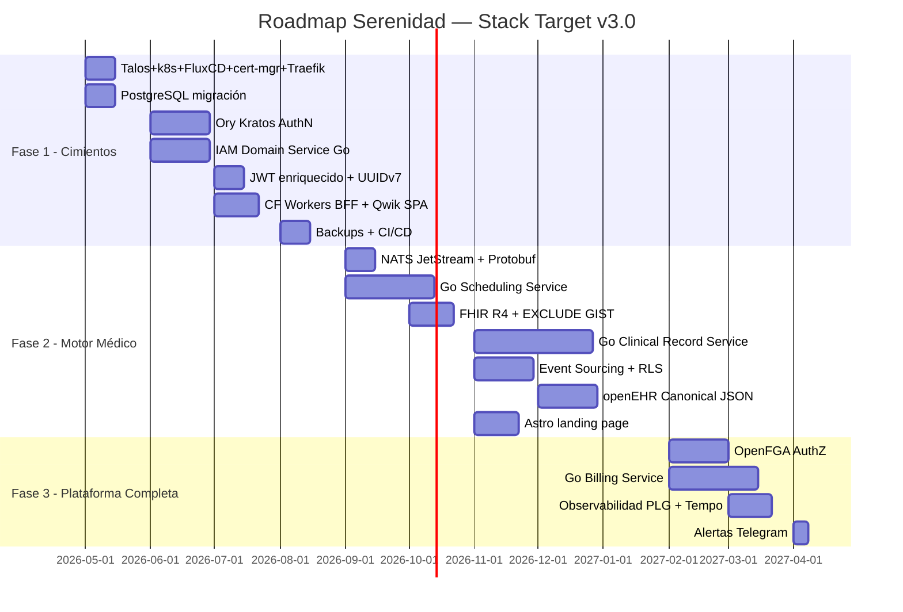

# Mapa de Brechas y Ruta de Construcción: Del Diseño al Target v3.0

**Proyecto:** Serenidad — Clínica Digital de Salud Mental Global  
**Versión:** 2.0 — Actualizado con Stack Target v3.0  
**Fecha:** Abril 2026  
**Autor:** djca / Roo Architect Mode  
**Restricciones activas:** Build It Right The First Time + Costo Mínimo + Open Source + Control Total + No Reinventar la Rueda

---

## Índice

1. [Estado Destino — Stack Target v3.0](#2-estado-destino--stack-target-v30)
2. [Mapa de Brechas Actualizado](#3-mapa-de-brechas-actualizado)
3. [Visión General del Roadmap](#4-visión-general-del-roadmap)
4. [Fase 1: VPS + PostgreSQL + IAM + Gateway](#4-fase-1-vps--postgresql--iam--gateway)
5. [Fase 2: Motor Médico — Scheduling + Clinical + NATS](#5-fase-2-motor-médico--scheduling--clinical--nats)
6. [Fase 3: Plataforma Completa — Billing + OpenFGA + Observabilidad](#6-fase-3-plataforma-completa--billing--openfga--observabilidad)
7. [Principios de Construcción](#7-principios-de-construcción)
8. [Riesgos y Mitigaciones por Fase](#8-riesgos-y-mitigaciones-por-fase)
9. [Indicadores de Éxito](#9-indicadores-de-éxito)
10. [Resumen Ejecutivo](#10-resumen-ejecutivo)

---

## 1. Estado Destino — Stack Target v3.0

```
TARGET v4.0 — El sistema en estado final (Abril 2026)

Infraestructura:
  Hetzner CX32 (~$7.50/mes) + Talos Linux v1.10.x + Kubernetes 1.33.x
  FluxCD v2.x (GitOps — Git es la única fuente de verdad)

Ingress + TLS:
  cert-manager v1.x (Let's Encrypt auto-renovado)
  Traefik v3.x (IngressRoute CRDs + ForwardAuth Middleware)
  Sealed Secrets v0.27+ (secrets cifrados en Git)

Frontend ($0):
  Qwik SPA (Cloudflare Pages) — portales médico y paciente
  Astro v6.x (Cloudflare Pages) — landing page + SEO

Gateway ($0):
  Hono v4.x en Cloudflare Workers (BFF)
  Traefik ForwardAuth → IAM Service (reemplaza Caddy forward_auth)

IAM (self-hosted en k8s namespace: serenidad-core):
  Ory Kratos v1.3.1 → AuthN (Passkeys, MFA, sesiones) via Helm
  OpenFGA v1.x → AuthZ (Zanzibar relation tuples) via Helm
  IAM Domain Service → Go, JWT enriquecido, Outbox

Microservicios Core (Go, Deployment+Service en serenidad-core):
  Scheduling Service → FHIR + EXCLUDE GIST + NATS Outbox
  Clinical Record Service → Event Store puro + openEHR JSON
  Billing & Ops Service → Transacciones + multi-pasarela

Event Bus (self-hosted en serenidad-data):
  NATS JetStream v2.11.x — streams por dominio, retención por tipo
  Helm: nats/nats, storage=file (PVC persistido)

Serialización:
  Protobuf proto3 + buf.build CLI

Persistencia (self-hosted en serenidad-data):
  CloudNativePG v1.x — PostgreSQL 17.4 — 6 databases via Cluster CRD
  WAL continuo → Backblaze B2 (PITR disponible, barman-cloud)
  ScheduledBackup CRD (02:00 UTC, retención 30 días base + 90 WAL)

Estándares Médicos:
  FHIR R4 — output APIs
  openEHR Canonical JSON — formato de eventos clínicos

Observabilidad (self-hosted en serenidad-ops, Fase 3):
  kube-prometheus-stack v82.x + Loki v3.x + Tempo v2.9+
  Grafana v11.x + Alertmanager v0.27+ → Telegram bot

Ver ADRs definitivos: plans/06_talos_k8s_decision_y_cambios_en_cadena.md
```

---

## 2. Mapa de Brechas Actualizado

### 3.1 Brechas por Fase

| ID | Brecha | Complejidad | Prerequisito | Fase |
|----|--------|-------------|--------------|------|
| G-06 | Hetzner CX32 + Talos Linux v1.10.x + Kubernetes 1.33.x + FluxCD bootstrap | Baja | Cuenta Hetzner | Fase 1 |
| G-07 | cert-manager v1.x + Traefik v3.x + Sealed Secrets | Baja | k8s + DNS | Fase 1 |
| G-08 | CloudNativePG v1.x + PostgreSQL 17.4 (Cluster CRD) | Media | k8s | Fase 1 |
| G-09 | Ory Kratos (AuthN) | Alta | PG, VPS | Fase 1 |
| G-10 | IAM Domain Service (Go) | Alta | Kratos, PG, NATS | Fase 1 |
| G-11 | JWT enriquecido con UUIDv7 | Media | IAM Domain | Fase 1 |
| G-09 | Qwik SPA desacoplado del backend | Media | Gateway | Fase 1 |
| G-10 | Hono.js en Cloudflare Workers (BFF) | Media | IAM JWT | Fase 1 |
| G-11 | Tests E2E del flujo de pago | Media | Deploy real | Fase 1 |
| G-12 | CI/CD básico (GitHub Actions) | Media | Tests | Fase 1 |
| G-13 | NATS JetStream self-hosted | Baja | VPS | Fase 2 |
| G-14 | Protobuf schemas + buf.build | Media | NATS | Fase 2 |
| G-15 | Go Scheduling Service | Alta | PG, NATS, Protobuf | Fase 2 |
| G-16 | FHIR R4 Appointment output | Alta | Scheduling | Fase 2 |
| G-17 | EXCLUDE USING GIST en PG | Media | PG, Scheduling | Fase 2 |
| G-18 | Go Clinical Record Service | Muy Alta | NATS, PG, openEHR | Fase 2 |
| G-19 | Event Sourcing (BYTEA append-only) | Alta | Clinical | Fase 2 |
| G-20 | openEHR Canonical JSON schemas | Alta | Clinical + Consultor médico | Fase 2 |
| G-21 | Outbox Pattern completo | Media | PG, NATS | Fase 2 |
| G-22 | Row-Level Security PostgreSQL | Alta | IAM JWT | Fase 2 |
| G-23 | OpenFGA (reemplaza Ory Keto) | Alta | PG, Kratos | Fase 3 |
| G-24 | Go Billing & Ops Service | Alta | NATS, PG, Scheduling | Fase 3 |
| G-25 | Observabilidad (PLG + Tempo) | Media | VPS, servicios Go | Fase 3 |
| G-26 | Alertas Telegram (Alertmanager) | Baja | Prometheus | Fase 3 |
| G-27 | Backups automáticos (CloudNativePG WAL + ScheduledBackup CRD → B2) | Baja | CloudNativePG | Fase 1 |
| G-28 | Astro 5 landing page | Media | Ninguno (paralelo) | Fase 2 |
| G-29 | DIDs (identidad soberana) | Muy Alta | IAM maduro | Fase 4+ |
| G-30 | Videoconsultas WebRTC | Alta | Frontend, infra video | Fase 4+ |

---

## 3. Visión General del Roadmap



---

## 4. Fase 1: Kubernetes + CloudNativePG + IAM + Gateway

> **Objetivo:** Construir los cimientos del target sobre Talos Linux + Kubernetes en Hetzner CX32. IAM completo. PostgreSQL 17.4 self-hosted via CloudNativePG operator.  
> **Costo:** ~$7.50/mes (VPS Hetzner CX32)
>
> **Referencia exhaustiva:** [`plans/05_orden_implementacion_capas_exhaustivo.md`](./05_orden_implementacion_capas_exhaustivo.md) y [`plans/06_talos_k8s_decision_y_cambios_en_cadena.md`](./06_talos_k8s_decision_y_cambios_en_cadena.md) contienen todos los detalles de implementación.

### Tarea F1-01: Bootstrap Talos Linux + Kubernetes + FluxCD

```bash
# 1. Crear VPS en Hetzner Cloud
#    → cloud.hetzner.com → Create Server → CX32 → Frankfurt
#    → Custom Image: Talos Linux v1.10.x ISO (Hetzner public)
#    → Sin SSH key — Talos no usa SSH

# 2. Generar configuración Talos desde máquina local:
talosctl gen config serenidad https://<VPS_IP>:6443 \
  --output-dir infra/clusters/hetzner-prod/talos/ \
  --with-secrets secrets.yaml

# 3. Aplicar configuración y bootstrapear etcd:
talosctl apply-config --insecure --nodes <VPS_IP> \
  --file infra/clusters/hetzner-prod/talos/controlplane.yaml
talosctl bootstrap --nodes <VPS_IP>

# 4. Obtener kubeconfig:
talosctl kubeconfig --nodes <VPS_IP> --force

# 5. Bootstrap FluxCD (GitOps):
flux bootstrap github \
  --owner=serenidad \
  --repository=serenidad-platform \
  --branch=main \
  --path=infra/clusters/hetzner-prod
```

Estructura del monorepo GitOps:
```
serenidad-platform/
├── apps/
│   ├── web/              → Qwik v2.0 SPA
│   └── bff/              → Hono v4.x para Cloudflare Workers
├── services/
│   ├── iam/              → Go IAM Domain Service
│   ├── scheduling/       → Go Scheduling Service (Fase 2)
│   ├── clinical/         → Go Clinical Record (Fase 2)
│   └── billing/          → Go Billing Service (Fase 3)
├── packages/
│   └── events/           → .proto schemas + generated Go code
└── infra/
    ├── clusters/hetzner-prod/
    │   ├── talos/         → Talos machine configs
    │   └── flux-system/   → FluxCD bootstrap
    ├── infrastructure/
    │   ├── cert-manager/  → HelmRelease + ClusterIssuer
    │   ├── traefik/       → HelmRelease
    │   ├── cnpg/          → HelmRelease + Cluster CRD
    │   ├── nats/          → HelmRelease (Fase 2)
    │   └── sealed-secrets/→ HelmRelease
    ├── apps/
    │   ├── iam-service/   → Deployment + Service + IngressRoute
    │   ├── scheduling/    → Deployment + Service (Fase 2)
    │   ├── clinical/      → Deployment + Service (Fase 2)
    │   └── billing/       → Deployment + Service (Fase 3)
    └── secrets/           → SealedSecrets (cifrados, seguros en Git)
```

### Tarea F1-02: cert-manager + Traefik v3.x (Ingress + TLS)

Reemplaza Caddy v2.9+. Ver detalles en planes/05 sección 3.2.

La equivalencia funcional clave es:
- `Caddy forward_auth` → `Traefik ForwardAuth Middleware`
- `Caddy reverse_proxy` → `Traefik IngressRoute + Service`
- `Caddy TLS automático` → `cert-manager ClusterIssuer Let's Encrypt`

La lógica IAM en `/internal/validate-token` no cambia — solo el llamador cambia de Caddy a Traefik.

### Tarea F1-03: CloudNativePG + PostgreSQL 17.4 (Cluster CRD)

Reemplaza `postgres:17-alpine` directo. Ver detalles en planes/05 sección 3.3.

CloudNativePG gestiona el ciclo de vida completo del cluster PostgreSQL via CRD declarativo:
- 6 databases aisladas (iam_db, scheduling_db, clinical_db, billing_db, kratos_db, openfga_db)
- WAL archiving continuo → Backblaze B2 (sin ventana de pérdida de 24h de pg_dump)
- PITR (Point-In-Time Recovery) a cualquier momento
- Auto-generated Secrets con connection strings para los servicios Go


### Tarea F1-04: Ory Kratos (AuthN)

```yaml
# infra/kratos/kratos.yml (configuración clave)
version: v1.3

selfservice:
  default_browser_return_url: https://app.sereni.dad/
  allowed_return_urls:
    - https://app.sereni.dad/
  
  flows:
    login:
      ui_url: https://app.sereni.dad/auth/login
      lifespan: 10m
    registration:
      ui_url: https://app.sereni.dad/auth/register
      lifespan: 10m
    recovery:
      enabled: true
      ui_url: https://app.sereni.dad/auth/recovery
  
  methods:
    passkey:
      enabled: true
      config:
        rp:
          display_name: Serenidad
          id: sereni.dad
          origins:
            - https://app.sereni.dad
    
    password:
      enabled: false  # Solo passkeys por defecto

session:
  cookie:
    domain: sereni.dad
    same_site: Lax
  lifespan: 720h  # 30 días

identity:
  default_schema_id: patient
  schemas:
    - id: patient
      url: file:///etc/config/kratos/schemas/patient.json
    - id: doctor
      url: file:///etc/config/kratos/schemas/doctor.json
```

### Tarea F1-05: IAM Domain Service (Go)

```go
// services/iam/cmd/main.go
package main

import (
    "context"
    "log/slog"
    "net/http"
    "os"
    
    "github.com/go-chi/chi/v5"
    "github.com/go-chi/chi/v5/middleware"
    "github.com/jackc/pgx/v5/pgxpool"
    kratosclient "github.com/ory/kratos-client-go"
    openfgaclient "github.com/openfga/go-sdk"
    natsclient "github.com/nats-io/nats.go"
)

type App struct {
    db      *pgxpool.Pool
    kratos  *kratosclient.APIClient
    openfga *openfgaclient.OpenFgaClient
    nats    *natsclient.Conn
    logger  *slog.Logger
}

func main() {
    logger := slog.New(slog.NewJSONHandler(os.Stdout, nil))
    
    // Inicializar conexiones (sin reinventar la rueda)
    db := mustConnectPG(os.Getenv("IAM_DB_URL"))
    kratos := mustConnectKratos(os.Getenv("KRATOS_ADMIN_URL"))
    fga := mustConnectOpenFGA(os.Getenv("OPENFGA_URL"), os.Getenv("OPENFGA_STORE_ID"))
    nc := mustConnectNATS(os.Getenv("NATS_URL"))
    
    app := &App{db: db, kratos: kratos, openfga: fga, nats: nc, logger: logger}
    
    // Router Chi (no reinventar routing)
    r := chi.NewRouter()
    r.Use(middleware.Logger)
    r.Use(middleware.Recoverer)
    r.Use(middleware.RealIP)
    
    // Endpoints públicos IAM
    r.Post("/api/iam/token/exchange", app.ExchangeKratosSession)
    r.Post("/api/iam/users", app.RegisterUser)
    
    // Endpoint interno (usado por Traefik ForwardAuth Middleware)
    r.Get("/internal/validate-token", app.ValidateToken)
    
    // Métricas Prometheus (no reinventar)
    r.Handle("/metrics", promhttp.Handler())
    
    logger.Info("IAM Service starting", "port", "8080")
    http.ListenAndServe(":8080", r)
}

// ExchangeKratosSession: Kratos session → JWT enriquecido con UUIDv7 + rol
func (a *App) ExchangeKratosSession(w http.ResponseWriter, r *http.Request) {
    sessionToken := r.Header.Get("X-Session-Token")
    
    // 1. Verificar sesión con Kratos
    ctx := r.Context()
    session, _, err := a.kratos.FrontendAPI.ToSession(ctx).
        XSessionToken(sessionToken).
        Execute()
    if err != nil || !*session.Active {
        http.Error(w, "Unauthorized", http.StatusUnauthorized)
        return
    }
    
    // 2. Obtener o crear perfil de dominio del usuario
    userID, role, err := a.getUserProfile(ctx, session.Identity.Id)
    if err != nil {
        http.Error(w, "Profile not found", http.StatusNotFound)
        return
    }
    
    // 3. Construir y firmar JWT enriquecido (Ed25519)
    token, err := a.buildEnrichedJWT(userID, role, session.Identity)
    if err != nil {
        http.Error(w, "Internal error", http.StatusInternalServerError)
        return
    }
    
    // 4. Publicar evento DomainUserLoggedIn en NATS (via Outbox si es crítico)
    w.Header().Set("Content-Type", "application/json")
    json.NewEncoder(w).Encode(map[string]string{"token": token})
}
```

### Tarea F1-06: Backups automáticos desde el inicio (CloudNativePG WAL + B2)

Reemplaza `pg_dump + rclone + cron`. CloudNativePG gestiona el backup declarativamente via CRD:

```yaml
# infra/infrastructure/cnpg/scheduled-backup.yaml
apiVersion: postgresql.cnpg.io/v1
kind: ScheduledBackup
metadata:
  name: serenidad-pg-daily
  namespace: serenidad-data
spec:
  schedule: "0 2 * * *"  # 02:00 UTC diario
  backupOwnerReference: self
  cluster:
    name: serenidad-pg
  target: prefer-standby  # En Fase 4+ con réplicas
```

El WAL archiving continuo ya está configurado en el Cluster CRD (barman-cloud → B2). Esto garantiza PITR a cualquier punto, no solo a las instantáneas diarias. Ventana de pérdida de datos: segundos (vs 24h con pg_dump).

### Criterio de Éxito de Fase 1

```
✅ El paciente puede:
   1. Registrarse con Passkey (sin contraseña) via Ory Kratos
   2. Recibir un JWT enriquecido del IAM Domain Service
   3. Usar el JWT para todas las operaciones autenticadas

✅ La infraestructura:
   1. Hetzner CX32 corriendo Talos Linux v1.10.x + Kubernetes 1.33.x
   2. FluxCD v2.x reconciliando estado desde Git cada 1 minuto
   3. cert-manager + Traefik sirviendo api.sereni.dad con TLS Let's Encrypt
   4. CloudNativePG cluster con 6 databases aisladas y WAL continuo → B2
   5. ScheduledBackup CRD ejecutando snapshot diario a las 02:00 UTC
   6. Traefik ForwardAuth Middleware validando JWTs en todas las rutas /api/*

```

---

## 5. Fase 2: Motor Médico — Scheduling + Clinical + NATS

> **Objetivo:** Internalizar el sistema de agenda y construir la historia clínica inmutable.  
> **Prerequisito:** Fase 1 completa. IAM funcional. Cluster Kubernetes estable. Agregar worker CX32 si CPU/RAM supera 80%.

### Tarea F2-01: NATS JetStream v2.11.x (Helm: nats/nats)

```yaml
# infra/infrastructure/nats/helmrelease.yaml
apiVersion: helm.toolkit.fluxcd.io/v2
kind: HelmRelease
metadata:
  name: nats
  namespace: serenidad-data
spec:
  interval: 1h
  chart:
    spec:
      chart: nats
      version: ">=1.1.0 <2.0.0"
      sourceRef:
        kind: HelmRepository
        name: nats
        namespace: flux-system
  values:
    config:
      jetstream:
        enabled: true
        fileStorage:
          enabled: true
          size: 10Gi
          storageClassName: local-path
      cluster:
        enabled: false  # single-node Fase 1-3
    natsBox:
      enabled: true  # nats CLI para administración
```

Los 4 Streams con sus retenciones se crean via NACK CRDs (Kubernetes-native):

```yaml
# infra/infrastructure/nats/streams.yaml — 4 streams declarativos
# SERENIDAD_IAM: 365d, SERENIDAD_SCHED: 730d
# SERENIDAD_CLINICAL: ilimitado, SERENIDAD_BILLING: 3650d
```

### Tarea F2-02: Protobuf schemas + buf.build

```protobuf
// packages/events/proto/scheduling/v1/appointment_booked.proto
syntax = "proto3";
package serenidad.scheduling.v1;

import "google/protobuf/timestamp.proto";

message AppointmentBookedEvent {
    string event_id         = 1;  // UUIDv7
    string appointment_id   = 2;  // UUIDv7
    string patient_id       = 3;  // UUIDv7
    string doctor_id        = 4;  // UUIDv7
    google.protobuf.Timestamp start_time  = 5;
    google.protobuf.Timestamp end_time    = 6;
    string service_snomed_code = 7;  // SNOMED-CT
    FHIRAppointmentRef fhir_ref = 8;
}

message FHIRAppointmentRef {
    string resource_id   = 1;
    string resource_type = 2;  // "Appointment"
    string fhir_json     = 3;  // JSON completo del FHIR Appointment
}
```

```protobuf
// packages/events/proto/clinical/v1/diagnosis_recorded.proto
syntax = "proto3";
package serenidad.clinical.v1;

import "google/protobuf/timestamp.proto";

message DiagnosisRecordedEvent {
    string event_id          = 1;  // UUIDv7
    string ehr_id            = 2;  // UUIDv7 del EHR del paciente
    string patient_id        = 3;  // UUIDv7
    string doctor_id         = 4;  // UUIDv7
    string encounter_id      = 5;  // UUIDv7 de la consulta
    
    OpenEHRComposition composition = 6;  // openEHR Canonical JSON serializado
    
    string icd11_code        = 7;  // Para indexación rápida
    string icd11_display     = 8;  // Para proyección/read model
    
    google.protobuf.Timestamp recorded_at = 9;
    int64 schema_version = 10;  // Versión del openEHR archetype
}

message OpenEHRComposition {
    string archetype_id    = 1;  // "openEHR-EHR-COMPOSITION.encounter.v1"
    bytes  canonical_json  = 2;  // openEHR Canonical JSON completo
}
```

### Tarea F2-03: Go Scheduling Service

```go
// services/scheduling/internal/domain/appointment.go
package domain

import (
    "time"
    "github.com/google/uuid"
    "github.com/jackc/pgx/v5/pgtype"
)

type Appointment struct {
    ID           uuid.UUID
    DoctorID     uuid.UUID
    PatientID    uuid.UUID
    TimeSlot     pgtype.Tstzrange   // PostgreSQL TSTZRANGE nativo
    Status       AppointmentStatus
    FHIRResource []byte             // FHIR Appointment JSON
    CreatedAt    time.Time
}

// PostgreSQL Schema con EXCLUDE USING GIST:
const appointmentSchema = `
CREATE EXTENSION IF NOT EXISTS btree_gist;

CREATE TABLE appointments (
    id UUID PRIMARY KEY,
    doctor_id UUID NOT NULL,
    patient_id UUID NOT NULL,
    time_slot TSTZRANGE NOT NULL,
    status TEXT NOT NULL DEFAULT 'BOOKED'
        CHECK (status IN ('BOOKED', 'COMPLETED', 'CANCELLED')),
    fhir_resource JSONB,
    created_at TIMESTAMPTZ DEFAULT NOW(),
    
    -- La magia: dos citas del mismo doctor no pueden solaparse
    EXCLUDE USING GIST (
        doctor_id WITH =,
        time_slot WITH &&
    ) WHERE (status = 'BOOKED')
);

-- Outbox para garantía de publicación de eventos
CREATE TABLE outbox_events (
    id UUID PRIMARY KEY DEFAULT gen_random_uuid(),
    event_type TEXT NOT NULL,
    nats_subject TEXT NOT NULL,
    payload BYTEA NOT NULL,  -- Protobuf serializado
    published_at TIMESTAMPTZ,
    created_at TIMESTAMPTZ DEFAULT NOW()
);

-- Índice para el Outbox Worker
CREATE INDEX idx_outbox_pending ON outbox_events(created_at)
    WHERE published_at IS NULL;
`
```

### Tarea F2-04: Go Clinical Record Service (Event Store puro)

```go
// services/clinical/internal/eventstore/store.go
package eventstore

import (
    "context"
    "fmt"
    
    "github.com/jackc/pgx/v5/pgxpool"
    natsjc "github.com/nats-io/nats.go/jetstream"
    "google.golang.org/protobuf/proto"
    
    clinicalv1 "serenidad/packages/events/gen/go/clinical/v1"
)

const clinicalSchema = `
CREATE TABLE clinical_events (
    id UUID PRIMARY KEY,                    -- UUIDv7 (orden temporal)
    aggregate_id UUID NOT NULL,             -- ID del EHR del paciente
    aggregate_type TEXT NOT NULL,           -- 'EHR', 'Encounter', 'Diagnosis'
    event_type TEXT NOT NULL,               -- 'DiagnosisRecorded', etc.
    event_version INTEGER NOT NULL,         -- Versión del schema Protobuf
    payload BYTEA NOT NULL,                 -- Protobuf serializado
    metadata JSONB,                         -- doctor_id, ip, user_agent
    causation_id UUID,                      -- Evento que causó este
    correlation_id UUID,                    -- Request original
    occurred_at TIMESTAMPTZ NOT NULL DEFAULT NOW()
    
    -- NUNCA hay UPDATE ni DELETE en esta tabla
    -- Es inmutable por diseño: es la historia clínica legal
);

-- Row-Level Security: alimentado por el JWT del IAM Service
ALTER TABLE clinical_events ENABLE ROW LEVEL SECURITY;

CREATE POLICY patient_sees_own_ehr ON clinical_events
    FOR SELECT
    USING (
        -- El paciente ve solo su propio EHR
        aggregate_id = current_setting('app.patient_ehr_id', TRUE)::uuid
        OR
        -- El doctor ve los EHRs de sus pacientes (verificado via OpenFGA)
        current_setting('app.user_role', TRUE) = 'doctor'
    );

-- Outbox (misma tabla, misma transacción que el evento clínico)
CREATE TABLE clinical_outbox (
    id UUID PRIMARY KEY DEFAULT gen_random_uuid(),
    event_type TEXT NOT NULL,
    nats_subject TEXT NOT NULL,
    payload BYTEA NOT NULL,
    published_at TIMESTAMPTZ,
    created_at TIMESTAMPTZ DEFAULT NOW()
);

-- Proyección/Read Model para consultas rápidas
CREATE TABLE clinical_diagnoses_view (
    event_id UUID PRIMARY KEY REFERENCES clinical_events(id),
    patient_id UUID NOT NULL,
    doctor_id UUID NOT NULL,
    encounter_id UUID NOT NULL,
    icd11_code TEXT NOT NULL,
    icd11_display TEXT NOT NULL,
    archetype_id TEXT NOT NULL,
    recorded_at TIMESTAMPTZ NOT NULL
);
`

// AppendEvent: el corazón del Event Store — NUNCA UPDATE, solo INSERT
func (s *EventStore) AppendEvent(ctx context.Context, event *ClinicalEvent) error {
    // Serializar el evento en Protobuf
    payload, err := proto.Marshal(event.Proto)
    if err != nil {
        return fmt.Errorf("marshal event: %w", err)
    }
    
    // Transacción ATÓMICA: insertar evento + outbox en la MISMA transacción
    // Si falla cualquier parte, se revierte todo
    tx, err := s.pool.Begin(ctx)
    if err != nil {
        return err
    }
    defer tx.Rollback(ctx)
    
    // 1. Insertar el evento clínico (inmutable)
    _, err = tx.Exec(ctx, `
        INSERT INTO clinical_events
            (id, aggregate_id, aggregate_type, event_type, event_version, payload, metadata, occurred_at)
        VALUES ($1, $2, $3, $4, $5, $6, $7, $8)
    `, event.ID, event.AggregateID, event.AggregateType,
       event.Type, event.Version, payload, event.Metadata, event.OccurredAt)
    if err != nil {
        return fmt.Errorf("insert event: %w", err)
    }
    
    // 2. Insertar en outbox (para publicación async a NATS)
    _, err = tx.Exec(ctx, `
        INSERT INTO clinical_outbox (event_type, nats_subject, payload)
        VALUES ($1, $2, $3)
    `, event.Type, "clinical."+event.NATSSubject, payload)
    if err != nil {
        return fmt.Errorf("insert outbox: %w", err)
    }
    
    // 3. Actualizar proyección/read model si es un DiagnosisRecorded
    if event.Type == "DiagnosisRecorded" {
        diag := event.Proto.(*clinicalv1.DiagnosisRecordedEvent)
        _, err = tx.Exec(ctx, `
            INSERT INTO clinical_diagnoses_view
                (event_id, patient_id, doctor_id, encounter_id, icd11_code, icd11_display, archetype_id, recorded_at)
            VALUES ($1, $2, $3, $4, $5, $6, $7, $8)
        `, event.ID, diag.PatientId, diag.DoctorId, diag.EncounterId,
           diag.Icd11Code, diag.Icd11Display,
           diag.Composition.ArchetypeId, event.OccurredAt)
        if err != nil {
            return fmt.Errorf("update projection: %w", err)
        }
    }
    
    return tx.Commit(ctx)
}
```

### Criterio de Éxito de Fase 2

```
✅ El médico puede:
   1. Ver su agenda en el portal Qwik (desde Scheduling Service, no Cal.com)
   2. Reservar y bloquear slots con garantía de exclusividad (EXCLUDE GIST)
   3. Registrar un diagnóstico con código ICD-11 durante la consulta
   4. El diagnóstico se almacena como evento inmutable (BYTEA Protobuf)
   5. El evento viaja por NATS → el stack está event-driven

✅ El paciente puede:
   1. Ver su historial de diagnósticos (via proyección SQL)
   2. Solo ve SUS datos (RLS garantizado por JWT enriquecido)
   
✅ Los estándares médicos:
   1. FHIR Appointment generado para cada reserva
   2. openEHR Canonical JSON en los eventos clínicos
```

---

## 6. Fase 3: Plataforma Completa — Billing + OpenFGA + Observabilidad

> **Objetivo:** Cerrar el cuadrant restante del target. Billing automatizado, AuthZ Zanzibar, observabilidad completa.

### Tarea F3-01: OpenFGA (reemplaza Ory Keto)

```go
// services/iam/internal/authz/openfga.go
package authz

import (
    "context"
    "fmt"
    
    openfga "github.com/openfga/go-sdk"
    client "github.com/openfga/go-sdk/client"
)

type AuthzService struct {
    fga     *client.OpenFgaClient
    storeID string
}

// Modelo de autorización para Serenidad
// Registrar en OpenFGA una sola vez al inicializar:
const authorizationModel = `
model
  schema 1.1

type user

type patient
  relations
    define user: [user]

type doctor
  relations
    define user: [user]

type clinical_record
  relations
    define patient: [patient]
    define can_read:  (user from patient) or can_write
    define can_write: [doctor]

type appointment
  relations
    define doctor: [doctor]
    define patient: [patient]
    define can_view: (user from doctor) or (user from patient)

type organization
  relations
    define admin: [user]
    define member: [user] or admin
`

// Verificar: ¿puede el doctor escribir en la historia clínica?
func (a *AuthzService) CanDoctorWriteRecord(
    ctx context.Context,
    doctorUserID, recordID string,
) (bool, error) {
    resp, err := a.fga.Check(ctx).
        Body(client.ClientCheckRequest{
            User:     fmt.Sprintf("user:%s", doctorUserID),
            Relation: "can_write",
            Object:   fmt.Sprintf("clinical_record:%s", recordID),
        }).Execute()
    if err != nil {
        return false, err
    }
    return *resp.Allowed, nil
}

// Crear relación: asignar doctor a historia clínica
func (a *AuthzService) AssignDoctorToRecord(
    ctx context.Context,
    doctorID, recordID string,
) error {
    _, err := a.fga.WriteTuples(ctx).
        Body(client.ClientWriteRequest{
            Writes: []openfga.TupleKey{{
                User:     fmt.Sprintf("doctor:%s", doctorID),
                Relation: "can_write",
                Object:   fmt.Sprintf("clinical_record:%s", recordID),
            }},
        }).Execute()
    return err
}
```

### Tarea F3-02: Go Billing & Ops Service

```go
// services/billing/internal/billing.go
package billing

// El Billing Service es event-driven.
// Escucha: ConsultationFinished → genera factura → publica PaymentCaptured

func (b *BillingService) HandleConsultationFinished(ctx context.Context, event *ConsultationFinishedEvent) error {
    // 1. Calcular monto según el tipo de servicio y el médico
    amount, currency := b.calculateAmount(event.ServiceType, event.DoctorID)
    
    // 2. Crear transacción financiera (inmutable — igual que el event store)
    tx := &FinancialTransaction{
        ID:              newUUIDv7(),
        AppointmentID:   event.AppointmentID,
        PatientID:       event.PatientID,
        DoctorID:        event.DoctorID,
        AmountCents:     amount,
        CurrencyISO4217: currency,
        Status:          "PENDING",
        TaxCountryCode:  b.getTaxCountry(event.DoctorID),
    }
    
    // 3. Intentar cobro con la pasarela del médico (Izipay, Stripe, Conekta)
    gateway := b.gatewayFor(event.DoctorID)
    chargeResult, err := gateway.Charge(ctx, tx)
    
    if err == nil {
        // 4. Nueva transacción CAPTURED (no UPDATE — es inmutable)
        captured := tx.WithStatus("CAPTURED", chargeResult.GatewayTxID)
        if err := b.store.AppendTransaction(ctx, captured); err != nil {
            return err
        }
        
        // 5. Publicar PaymentCaptured a NATS (via Outbox)
        b.publishEvent(ctx, "billing.payments.captured.v1", &PaymentCapturedEvent{
            TransactionId: captured.ID.String(),
            AppointmentId: event.AppointmentID,
            AmountCents:   amount,
            Currency:      currency,
        })
    }
    
    return err
}
```

### Tarea F3-03: Observabilidad completa (kube-prometheus-stack v82.x)

Reemplaza el stack de contenedores Docker individuales. Todo el observability stack se despliega via un único HelmRelease en el namespace `serenidad-ops`:

```yaml
# infra/infrastructure/monitoring/helmrelease.yaml
apiVersion: helm.toolkit.fluxcd.io/v2
kind: HelmRelease
metadata:
  name: kube-prometheus-stack
  namespace: serenidad-ops
spec:
  interval: 1h
  chart:
    spec:
      chart: kube-prometheus-stack
      version: ">=82.0.0 <83.0.0"
      sourceRef:
        kind: HelmRepository
        name: prometheus-community
        namespace: flux-system
  values:
    prometheus:
      prometheusSpec:
        retention: 30d
        serviceMonitorSelectorNilUsesHelmValues: false
    grafana:
      adminPassword: "${GRAFANA_ADMIN_PASSWORD}"
      sidecar:
        dashboards:
          enabled: true
    alertmanager:
      config:
        receivers:
          - name: telegram-alerts
            telegram_configs:
              - bot_token: "${TELEGRAM_BOT_TOKEN}"
                chat_id: "${TELEGRAM_CHAT_ID}"
```

ServiceMonitor CRDs para auto-discovery en todos los servicios Go (via `/metrics` endpoint).
Loki v3.x + Tempo v2.9+ se instalan como HelmReleases separadas en el mismo namespace.

```yaml
# infra/alertmanager/alertmanager.yml — Alertas a Telegram (gratis)
global:
  resolve_timeout: 5m

route:
  receiver: 'telegram-alerts'
  group_wait: 30s
  group_interval: 5m
  repeat_interval: 4h

receivers:
  - name: 'telegram-alerts'
    telegram_configs:
      - bot_token: '${TELEGRAM_BOT_TOKEN}'
        chat_id: ${TELEGRAM_CHAT_ID}
        message: |
          🚨 *{{ .GroupLabels.alertname }}*
          *Severity:* {{ .CommonLabels.severity }}
          *Summary:* {{ .CommonAnnotations.summary }}
          *Description:* {{ .CommonAnnotations.description }}
```

### Criterio de Éxito de Fase 3

```
✅ La clínica puede:
   1. Facturar automáticamente post-consulta
   2. Los permisos médico-paciente-historia son Zanzibar (OpenFGA)
   3. El solopreneur recibe alertas en Telegram si algo falla
   4. Grafana muestra el estado de todos los servicios en tiempo real

✅ Estándares médicos completos:
   1. Historias clínicas con openEHR Canonical JSON
   2. APIs exponen recursos FHIR R4
   3. Cumplimiento GDPR: export de datos del paciente posible

✅ Costo: ~$22-27/mes (Hetzner CX32 + Cloudflare gratuito + Backblaze B2)
```

---

## 7. Principios de Construcción

### 9.2 Reglas de Oro

```
REGLA 1: Backup antes de cualquier cambio de schema o datos
  Antes de cualquier cambio de schema o migración de datos:
    → CloudNativePG: kubectl cnpg backup serenidad-pg (base backup manual)
    → Verificar que el backup es restaurable (test de restore via PITR)

REGLA 2: Un servicio Go = un binario que compila y tiene tests
  Antes de deployar un nuevo microservicio Go a producción:
    → go build completa sin errores
    → Tests unitarios de la lógica de dominio pasan
    → Health endpoint responde 200
    → Métricas Prometheus accesibles en /metrics

REGLA 3: Observabilidad antes que features
  Ningún servicio va a producción sin:
    → Structured logging (slog en Go)
    → /metrics endpoint (Prometheus)
    → Health check endpoint (/health)
    → Al menos una alerta de error rate configurada
```

---

## 8. Riesgos y Mitigaciones por Fase

### Fase 1

| Riesgo | Prob. | Mitigación |
|--------|-------|------------|
| k8s control plane overhead en CX32 (8GB) | Baja | Talos baseline ~850MB-1.15GB; 8GB es suficiente para Fase 1-3; upgrade CX42 en Fase 4+ si llega al 80% |
| Ory Kratos config complex (YAML extenso) | Alta | Empezar con config mínima (solo passkeys + 1 identity schema); iterar |
| Certificado TLS falla (cert-manager) | Baja | cert-manager maneja renovación automáticamente; ClusterIssuer Let's Encrypt ACME HTTP-01 |
| Talos node queda inaccesible | Baja | `talosctl recover` vía mTLS; Talos no requiere SSH; estado en etcd |

### Fase 2

| Riesgo | Prob. | Mitigación |
|--------|-------|------------|
| NATS JetStream pierde mensajes tras restart | Baja | JetStream usa file storage (disco), sobrevive reinicios |
| Outbox Worker publica dos veces (at-least-once) | Media | Consumidores NATS deben ser idempotentes; usar event_id como deduplication key |
| openEHR Canonical JSON incorrecto (arquetipos) | Alta | Contratar consultor de informática médica por proyecto (freelance, 10-20h) |
| EXCLUDE GIST no funciona en PG 17 | Baja | Testeado en PG 16+; `btree_gist` extension necesaria (incluir en init.sql) |

### Fase 3

| Riesgo | Prob. | Mitigación |
|--------|-------|------------|
| OpenFGA relaciones médicas complejas de modelar | Media | Usar https://play.fga.dev antes de escribir código |
| Billing Service depende de Izipay (solo para LATAM) | Alta | Diseñar con interfaz de gateway pluggable desde el inicio |
| Prometheus scrape llena disco (métricas se acumulan) | Media | Configurar `--storage.tsdb.retention.time=30d` |

---

## 9. Indicadores de Éxito

### KPIs de Negocio

| Fase | Indicador Principal | Meta |
|------|--------------------|----|
| 1 | Cluster Kubernetes operativo (FluxCD reconciliando) | drift = 0 |
| 1 | Usuarios autenticados con Passkey | 100% (nuevo flujo) |
| 1 | Incidentes de seguridad (auth) | 0 |
| 2 | Médico registra diagnóstico | < 2 minutos de latencia UX |
| 2 | Historia clínica accesible para paciente | < 500ms P99 |
| 3 | Factura generada post-consulta | < 5s (automática) |
| 3 | MTTR (mean time to recovery) ante fallo | < 30min (con alertas Telegram) |

### KPIs de Ingeniería

| Fase | Indicador | Meta |
|------|-----------|------|
| 1 | API Gateway P99 latencia | < 50ms |
| 1 | Traefik TLS handshake | < 1ms |
| 2 | NATS event delivery (at-least-once) | 0 pérdidas verificadas |
| 2 | EHR reconstitución (100 eventos) | < 100ms |
| 2 | EXCLUDE GIST (0 bookings solapados) | 0 conflictos de scheduling |
| 3 | Validez FHIR R4 de recursos generados | 100% (HAPI FHIR validator) |
| 3 | Costo total mensual del sistema | < $35/mes en Fase 3 |

---

## 10. Resumen Ejecutivo

### 12.1 El Roadmap en Una Tabla

| Fase | Duración | Costo Mensual | Outcome Principal | Prerequisito |
|------|----------|---------------|------------------|--------------|
| **Fase 1** | 3-4 meses | ~$7.50/mes (CX32+Talos+k8s) | IAM + CloudNativePG + Gateway + WAL Backups | — (primer paso) |
| **Fase 2** | 4-6 meses | ~$16/mes | Scheduling propio + Historia clínica inmutable + NATS | Fase 1 + Go conocido |
| **Fase 3** | 3-4 meses | ~$22-27/mes | Billing + OpenFGA + Observabilidad completa | Fase 2 |

**Total para alcanzar el target completo:** 13-18 meses desde hoy (solopreneur PRO, dedicación parcial).

### 12.2 Los Tres Principios que No Cambian

```
1. OPEN SOURCE PRIMERO
   Cada herramienta en el stack es open source y self-hosteable.
   NATS, PostgreSQL, Talos Linux, Kubernetes, Traefik, cert-manager,
   CloudNativePG, Ory Kratos, OpenFGA, Grafana, Prometheus, Loki —
   todo es Apache 2.0 o MIT. Cero dependencia de SaaS propietario en el path crítico.

2. NO REINVENTAR LA RUEDA
   Traefik ya resuelve ingress y ForwardAuth. cert-manager ya resuelve TLS. pgxpool ya resuelve conexiones PG.
   Chi ya resuelve routing. buf.build ya resuelve Protobuf schemas.
   prometheus/client_golang ya instrumenta Go services.
   La labor del solopreneur es CONECTAR herramientas probadas,
   no construir las herramientas.

3. BUILD IT RIGHT THE FIRST TIME
   Sin deuda técnica asumida. Estándares definitivos desde el día cero.
   El target es la arquitectura correcta para el producto final.
```


## Índice de Documentos de Arquitectura

| # | Documento | Estado |
|---|-----------|--------|
| 1 | [`plans/01_analisis_comparativo_repo_vs_target.md`](./01_analisis_comparativo_repo_vs_target.md) | Análisis comparativo del stack inicial vs target arch |
| 2 | [`plans/02_target_arch_deep_dive.md`](./02_target_arch_deep_dive.md) | Deep-dive de cada componente del target |
| 3 | [`plans/03_stack_alternatives_challenger.md`](./03_stack_alternatives_challenger.md) | Informe challenger v3.0 con decisiones finales |
| 4 | [`plans/04_gap_map_y_ruta_migracion.md`](./04_gap_map_y_ruta_migracion.md) | Este documento — mapa de brechas y roadmap |
| 5 | [`target_arch/descripcion.md`](../target_arch/descripcion.md) | Descripción maestra del target actualizada |
| 6 | [`target_arch/arch.puml`](../target_arch/arch.puml) | Diagrama arquitectural actualizado |
| 7 | [`target_arch/comp_iam_capa_core.puml`](../target_arch/comp_iam_capa_core.puml) | IAM con OpenFGA |
| 8 | [`target_arch/comp_infra_operaciones.puml`](../target_arch/comp_infra_operaciones.puml) | Topología VPS + Kubernetes (Talos Linux v1.10.x) v4.0 |
| 9 | [`plans/06_talos_k8s_decision_y_cambios_en_cadena.md`](./06_talos_k8s_decision_y_cambios_en_cadena.md) | ADR-010–014: decisión Talos + k8s y 18 cambios en cadena |

*Documento v2.0 generado en Abril 2026.*
