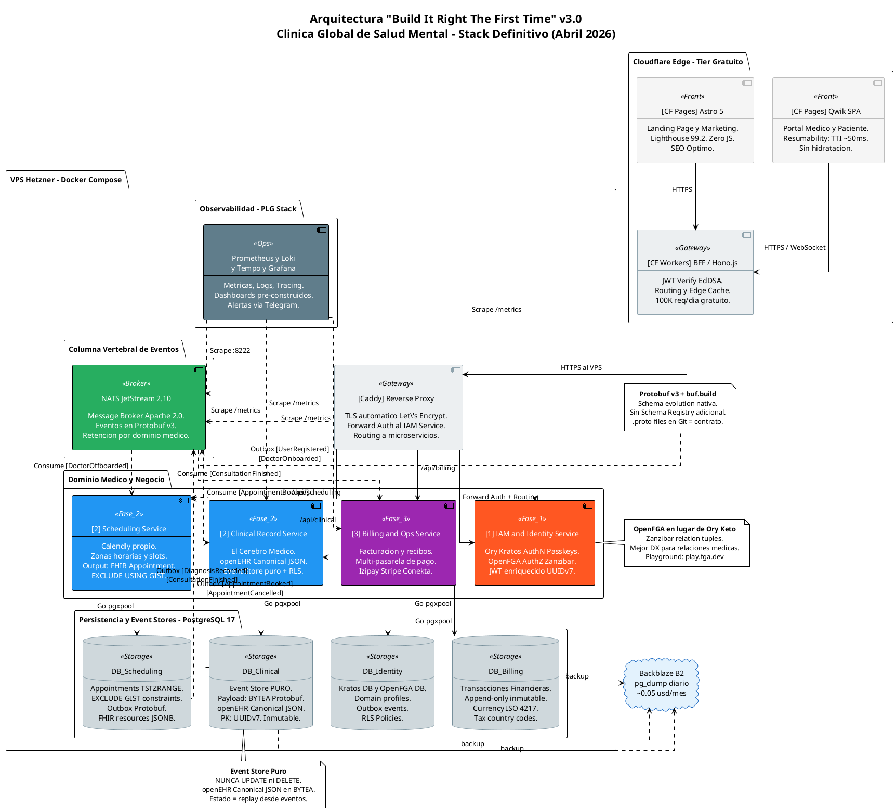
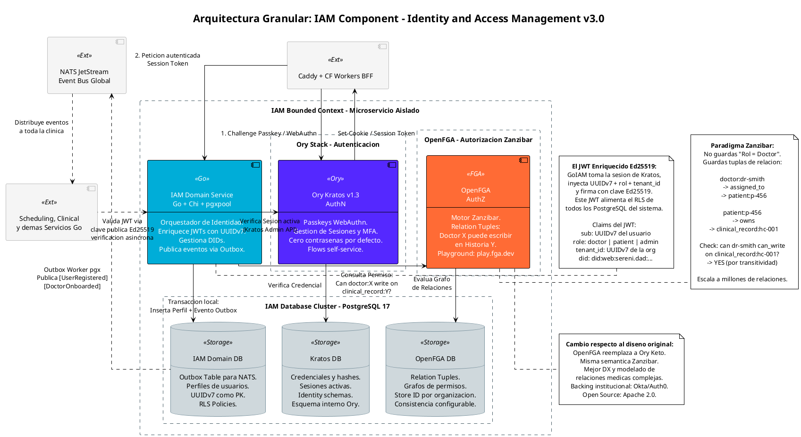
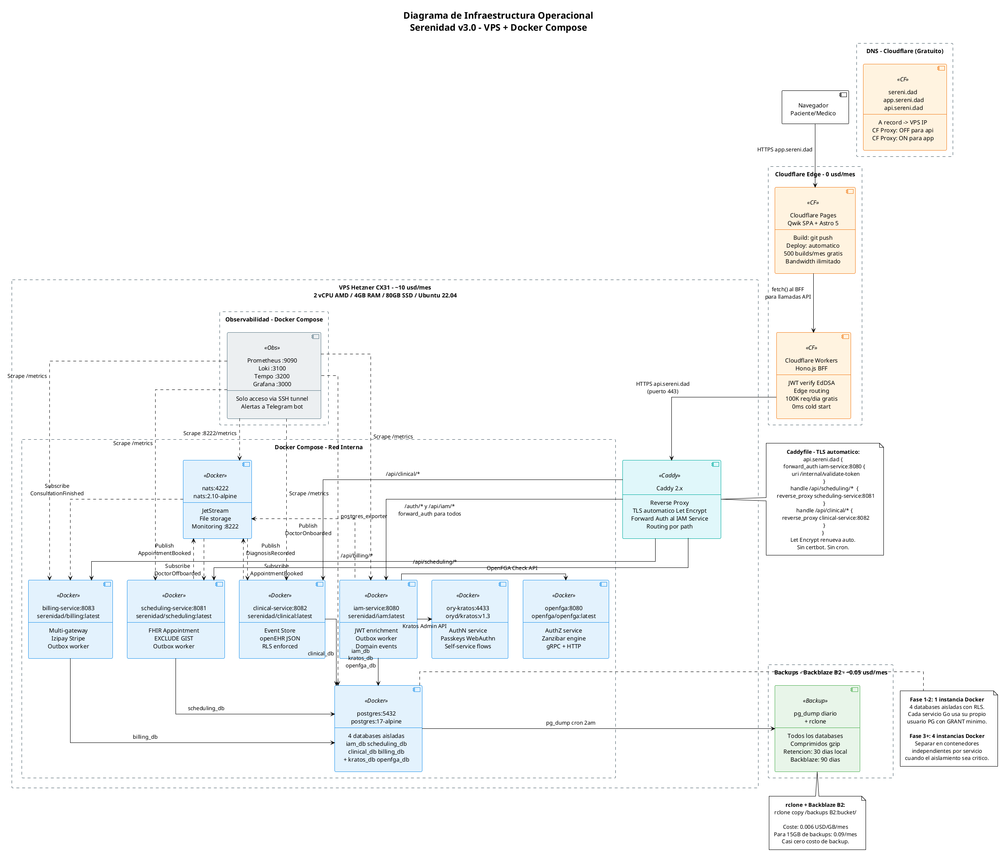

# Blueprint de Diagramas PlantUML — Actualización v4.0

**Propósito:** Historial de los diagramas PlantUML del target_arch y sus estados actuales. Los archivos `.puml` correspondientes ya han sido actualizados y reflejan el stack definitivo con Talos Linux + Kubernetes 1.33.x.

**Estado actual (v4.0 — Abril 2026):**
- `arch.puml`: Stack completo actualizado — Traefik v3.x, CloudNativePG, Talos+k8s, FluxCD GitOps
- `comp_iam_capa_core.puml`: Traefik ForwardAuth (reemplaza Caddy forward_auth), Helm-based deployment
- `comp_infra_operaciones.puml`: v4.0 — Topología Kubernetes/Talos completa (reemplaza Docker Compose)

**ADR de referencia:** [`plans/06_talos_k8s_decision_y_cambios_en_cadena.md`](../plans/06_talos_k8s_decision_y_cambios_en_cadena.md)

---

## 1. Contenido histórico de `target_arch/arch.puml` (pre-Kubernetes)

> **NOTA:** Este bloque es el contenido histórico pre-decisión Talos+k8s. El archivo `arch.puml` real ya ha sido actualizado a v4.0. Este bloque queda como referencia histórica del challenger analysis.

---

## 2. Contenido histórico de `target_arch/comp_iam_capa_core.puml` (pre-Kubernetes)

> **NOTA:** Versión histórica pre-decisión Talos+k8s. El archivo `comp_iam_capa_core.puml` real ya ha sido actualizado con referencias a Traefik ForwardAuth y Helm-based deployment.

---

## 3. Contenido histórico para `target_arch/comp_infra_operaciones.puml` (v3.0 — SUPERSEDIDO)

> **NOTA:** Este era el contenido v3.0 (Docker Compose). El archivo `comp_infra_operaciones.puml` real fue **completamente reescrito** a v4.0 con Talos Linux + Kubernetes. Este bloque queda únicamente como referencia histórica.

---

## Instrucciones para Code Mode

Para aplicar estos cambios, en Code Mode ejecutar:

1. **Reemplazar** el contenido de [`target_arch/arch.puml`](../target_arch/arch.puml) con el bloque PlantUML de la sección 1 (sin las marcas de código markdown).

2. **Reemplazar** el contenido de [`target_arch/comp_iam_capa_core.puml`](../target_arch/comp_iam_capa_core.puml) con el bloque PlantUML de la sección 2.

3. **Crear** el archivo [`target_arch/comp_infra_operaciones.puml`](../target_arch/comp_infra_operaciones.puml) con el contenido de la sección 3.

---

## Orden Final de Implementación — Referencia para los Diagramas

> Detalle completo en:
> - [`plans/05_orden_implementacion_capas_exhaustivo.md`](../plans/05_orden_implementacion_capas_exhaustivo.md)
> - [`plans/05b_orden_implementacion_capas_detalle.md`](../plans/05b_orden_implementacion_capas_detalle.md)

Los diagramas de este directorio representan el **estado final target** (v3.1). La tabla siguiente indica en qué fase y subcapa se construye cada componente visible en los diagramas:

| Componente (en diagramas) | Fase | Subcapa | Prerrequisito principal |
|---------------------------|------|---------|------------------------|
| Hetzner CX32 + Talos Linux v1.10.x + k8s 1.33.x + FluxCD | Fase 1 | 1.A | — |
| cert-manager v1.x + Traefik v3.x + Sealed Secrets | Fase 1 | 1.B | 1.A |
| CloudNativePG v1.x + PostgreSQL 17.4 (6 DBs) | Fase 1 | 1.C | 1.A |
| Schemas Protobuf + buf.build | Fase 1 | 1.D | 1.C |
| Ory Kratos v1.3.1 (AuthN, Helm: ory/kratos) | Fase 1 | 1.E | 1.C |
| IAM Domain Service Go (JWT Ed25519 + Outbox) + Traefik ForwardAuth | Fase 1 | 1.F | 1.C, 1.D, 1.E |
| BFF: CF Workers + Hono v4.x | Fase 1 | 1.G | 1.F |
| Qwik v2.0 SPA en CF Pages | Fase 1 | 1.H | 1.G |
| CloudNativePG ScheduledBackup CRD → B2 | Fase 1 | 1.I | 1.C |
| NATS JetStream v2.11.x (Helm: nats/nats) | Fase 2 | 2.A | 1.A–1.C |
| Outbox Worker (librería Go) | Fase 2 | 2.B | 2.A |
| Scheduling Service Go (Deployment + Service k8s) | Fase 2 | 2.C | 1.F, 2.A–2.B |
| Clinical Record Service Go (Deployment + Service k8s) | Fase 2 | 2.D | 1.F, 2.A–2.C |
| Landing Page Astro v6.x | Fase 2 | 2.E | 1.G |
| OpenFGA v1.x (AuthZ, Helm: openfga/openfga) | Fase 3 | 3.A | 1.C, 1.F |
| Billing & Ops Service Go (Deployment + Service k8s) | Fase 3 | 3.B | 1.F, 2.A–2.B, 2.D |
| kube-prometheus-stack v82.x + Loki v3.x + Tempo v2.9+ | Fase 3 | 3.C | 1.A |
| Alertmanager v0.27+ → Telegram | Fase 3 | 3.D | 3.C |

### Correspondencia diagrama → fase

| Diagrama | Componentes principales | Fases representadas |
|----------|------------------------|---------------------|
| `arch.puml` | Vista global de toda la arquitectura | Fases 1–3 (estado final target) |
| `comp_iam_capa_core.puml` | Detalle del IAM Bounded Context | Fase 1 (1.E, 1.F) + Fase 3 (3.A) |
| `comp_infra_operaciones.puml` | Topología Kubernetes + Talos Linux v4.0 | Fases 1–3 completo |
